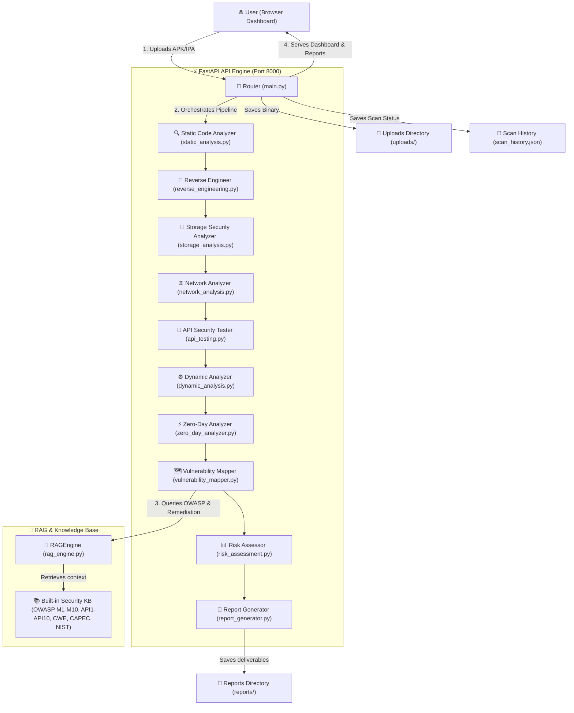
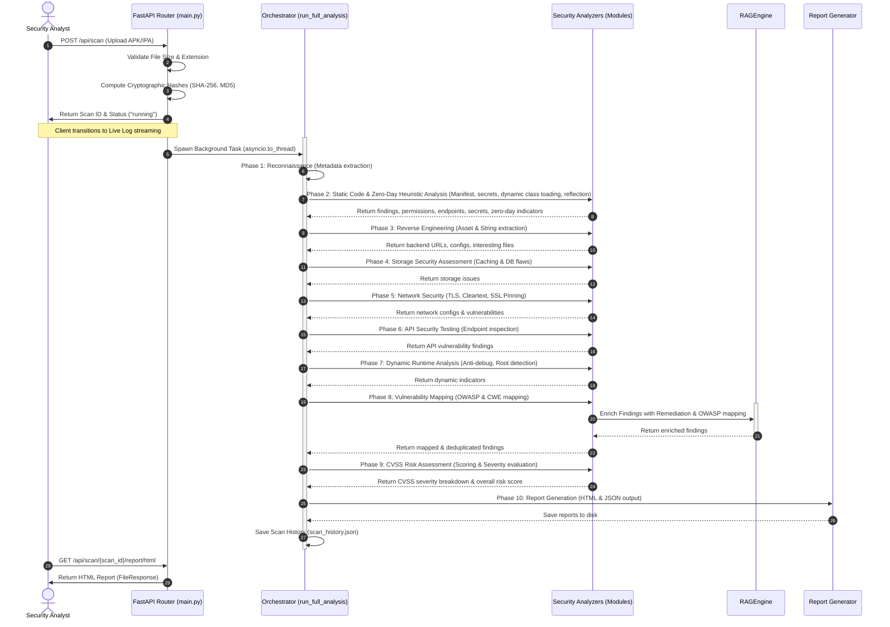

# 🛡️ Mobile Security Agent: Architecture & Security Pipeline Blueprint

Welcome to the comprehensive technical blueprint for the **Mobile Security Agent**. This document details the platform's decoupled architecture, runtime execution flows, RAG-powered vulnerability enrichment, and the inner workings of the 10-phase security penetration testing pipeline.

---

## 🏛️ Decoupled System Architecture

The Mobile Security Agent is built using a modern, decoupled architecture designed for high performance, ease of deployment, and absolute isolation from external database engines or heavy container runtimes. It is structured into three primary layers:



### 1. The Presentation Layer (Frontend Dashboard)
* **Stack**: HTML5, CSS3 (Vanilla), and Vanilla JavaScript (ES6+).
* **Delivery**: Served directly by the FastAPI backend via static mounts (`app.mount("/static")`) to minimize deployment complexity.
* **Mechanism**: Interacts with the backend entirely via asynchronous Fetch APIs. It features a modern dark-theme dashboard, live real-time analysis logs, vulnerability breakdowns, interactive risk charts, and downloadable reports.

### 2. The API & Orchestration Engine (Backend)
* **Stack**: Python 3.14+ and FastAPI.
* **Core Role**: Manages file uploads, runs asynchronous penetration testing workers, orchestrates the 10-phase security pipeline, and generates reports.
* **Concurrency**: Leverages FastAPI's background tasks (`BackgroundTasks`) and thread-pooling (`asyncio.to_thread`) to run intensive, CPU-bound binary analysis routines concurrently without blocking the API thread.

### 3. The RAG & Knowledge Base
* **Stack**: InMemory Search Engine via `RAGEngine` class.
* **Role**: Acts as a localized Retrieval-Augmented Generation (RAG) knowledge base.
* **Knowledge Sets**: Pre-loaded with the **OWASP Mobile Top 10 (2024)**, **OWASP API Top 10 (2023)**, and comprehensive remediation guides.
* **Mechanism**: Automatically queries the knowledge dictionary to enrich raw findings with descriptive explanations, severity classifications, and language-specific remediation code blocks.

---

## 🔄 End-to-End Penetration Testing Workflow

When an analyst uploads a mobile application binary (APK/IPA), the platform transitions the scan state to `running` and initiates an asynchronous worker. The diagram below illustrates the exact sequence of events:



---

## 🔍 The 10-Phase Security Pipeline: In-Depth Breakdown

Here is the exact technical breakdown of how each step in the pipeline is executed under the hood.

| Step | Phase Name | Responsible Module | Under the Hood Mechanisms & Techniques |
| :--- | :--- | :--- | :--- |
| **1** | **Reconnaissance** | `main.py` / `utils/file_handler.py` | Validates file integrity, parses extension (`.apk`, `.ipa`, `.xapk`), computes file size, and generates cryptographic checksums (**MD5**, **SHA-1**, **SHA-256**) to establish a tamper-proof binary fingerprint. |
| **2** | **Static & Zero-Day Heuristics**| `modules/static_analysis.py` & `modules/zero_day_analyzer.py`| Extracts configuration files and resources. Parses AndroidManifest.xml/Info.plist for configurations. Inspects code for hardcoded secrets, weak cryptography, dynamic class loading (DCL), custom XOR loops, reflection strings, and taint-flow patterns. |
| **3** | **Reverse Engineering**| `modules/reverse_engineering.py`| Searches through compiled assets, binaries, and configurations to extract hidden strings, developer notes, internal configurations, and API backend URLs. Catalogs interesting files such as local databases, certificates, or property files that could aid an attacker in reverse engineering. |
| **4** | **Storage Security** | `modules/storage_analysis.py` | Audits code references to identify data storage vulnerabilities. Scans for write operations to external public storage, plain-text usage of Shared Preferences / UserDefaults, unencrypted local SQLite databases, and cached Webview credentials. |
| **5** | **Network Security** | `modules/network_analysis.py` | Audits the application's network configuration profiles (such as Network Security Config on Android or App Transport Security on iOS). Specifically alerts if cleartext (HTTP) traffic is permitted, weak TLS handshakes are tolerated, or if certificate/SSL pinning checks are entirely absent in network classes. |
| **6** | **API Security** | `modules/api_testing.py` | Aggregates all backend URLs and REST/GraphQL endpoints discovered during static analysis and reverse engineering. Evaluates these endpoints for potential OWASP API Top 10 vulnerabilities (e.g., lack of authentication, cleartext HTTP schemes, exposed parameter variables). |
| **7** | **Dynamic Runtime** | `modules/dynamic_analysis.py` | Analyzes code indicators that affect runtime integrity, auditing for the existence of root/jailbreak detection checks, emulator prevention code, anti-debugging indicators, and runtime integrity checks. |
| **8** | **Vulnerability Map**| `modules/vulnerability_mapper.py`| Consolidates findings from all preceding stages, deduplicates identical issues, and maps each unique vulnerability to its corresponding **OWASP Mobile Top 10** or **OWASP API Top 10** category. Integrates with the local `RAGEngine` to attach deep context and remediation guides. |
| **9** | **Risk Assessment** | `modules/risk_assessment.py` | Calculates the overall threat score using CVSS-like severity weighting (Critical, High, Medium, Low, Info). Aggregates findings to compute a final risk classification (`CRITICAL`, `HIGH`, `MEDIUM`, `LOW`) representing the target app's overall security posture. |
| **10**| **Report Generation** | `modules/report_generator.py` | Synthesizes all scan metrics, findings, and metadata into two deliverables: a machine-readable `JSON` payload for automated dev pipelines, and an interactive, stylized `HTML` dashboard report for stakeholders. |

---

## 🧠 RAG & Knowledge Base Enrichment

The platform integrates a localized **RAG (Retrieval-Augmented Generation)** knowledge system to avoid relying on external, slow, or metered LLM APIs.

> [!NOTE]
> By keeping the RAG knowledge local and in-memory, the platform guarantees **zero-latency analysis** and **100% data privacy**—crucial when scanning proprietary corporate binaries.

### How Enrichment Works
1. When a vulnerability is mapped (e.g., a hardcoded API token is flagged as `M1: Improper Credential Usage`):
2. The `VulnerabilityMapper` calls the `RAGEngine` via `rag.enrich_finding(finding)`.
3. The RAG engine queries its localized dictionary, retrieving:
   - **Vulnerability Description**: Deep context on what the vulnerability is and how attackers exploit it.
   - **Remediation Guide**: A step-by-step developer guide showing how to secure the code (e.g., migrating from plain-text `SharedPreferences` to `EncryptedSharedPreferences`).
4. The final report is populated with these detailed remediation details, giving developers instant, actionable advice without requiring external research.

---

## 🛠️ Infrastructure VPS Deployment Architecture

For deployment onto production environments, the platform includes a customized `deploy.py` script. This script automates the secure deployment of the decoupled app onto raw Ubuntu VPS infrastructure:

```
                  +------------------------------------------+
                  |            Ubuntu VPS Server             |
                  |                                          |
                  |   +----------------------------------+   |
                  |   |    UFW Firewall (Port 8000)      |   |
                  |   +----------------+-----------------+   |
                  |                    |                     |
                  |   +----------------v-----------------+   |
                  |   |     FastAPI Daemon Service       |   |
                  |   |        (systemd service)         |   |
                  |   |   Runs: backend/main.py (uvicorn)|   |
                  |   +----------------+-----------------+   |
                  |                    |                     |
                  |   +----------------v-----------------+   |
                  |   |  Directory: /opt/mobile-agent    |   |
                  |   |   - uploads/                     |   |
                  |   |   - reports/                     |   |
                  |   |   - venv/ (isolated packages)    |   |
                  |   +----------------------------------+   |
                  +--------------------+---------------------+
                                       ^
                                       | SSH (Paramiko)
                                       |
                       +---------------+---------------+
                       |      Administrator Local      |
                       |       (python deploy.py)      |
                       +-------------------------------+
```

### Automated Steps Performed by `deploy.py`:
1. **Secure Transport**: Establishes an SSH channel using `Paramiko` to transfer the backend and frontend code to the remote server.
2. **Environment Setup**: Installs system-level Python packages, creates an isolated virtual environment, and installs production dependencies.
3. **Daemonization**: Registers the application as a background service via `systemd` (e.g., `/etc/systemd/system/mobile-security-agent.service`). This ensures that the server starts automatically on boot and restarts on crash.
4. **Firewall Configurations**: Configures `ufw` to secure the system, opening only the necessary port (`8000`) for API and web access.
