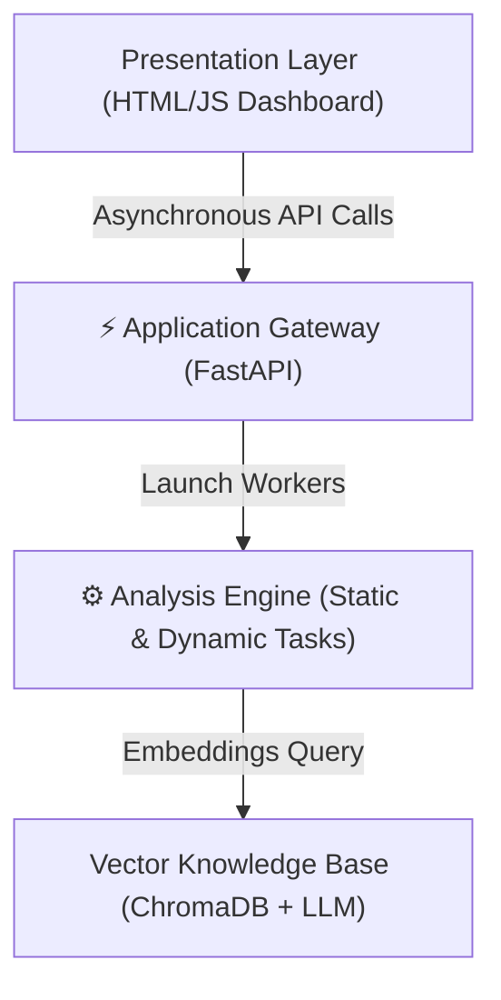
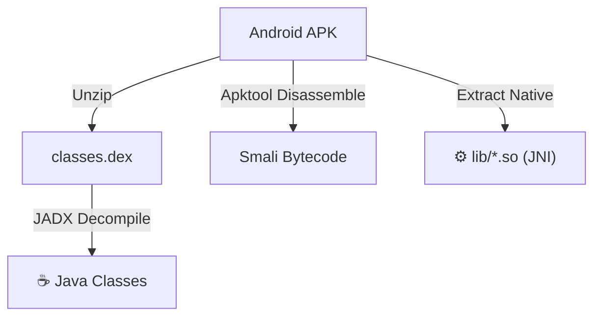
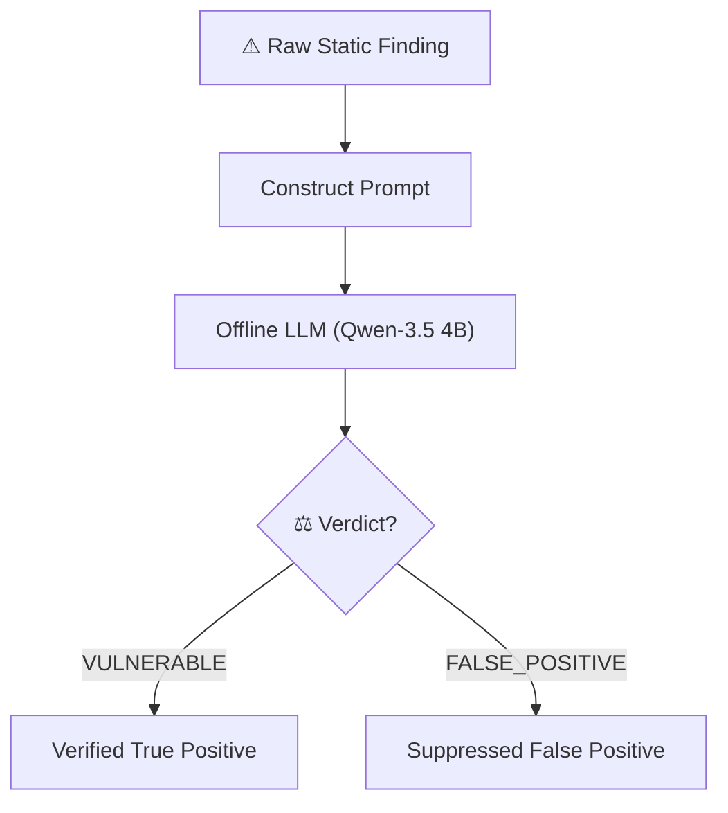
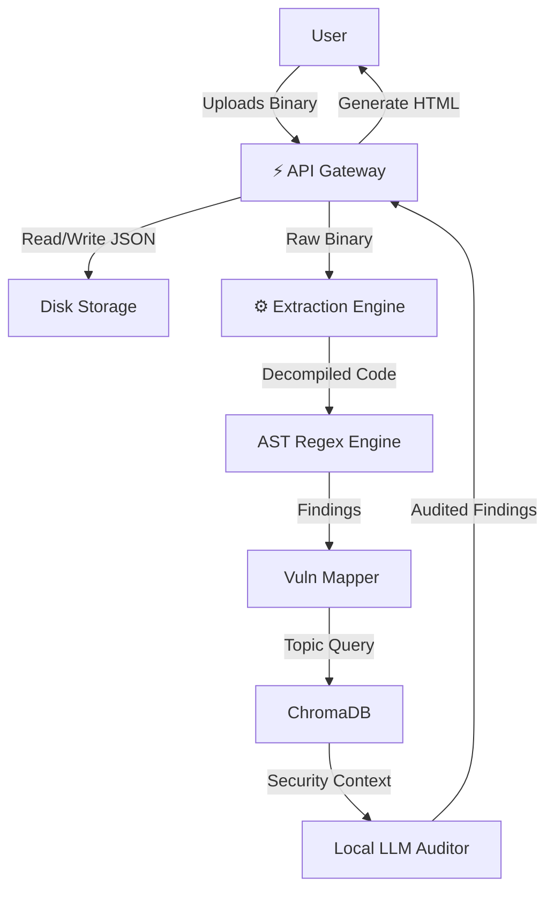
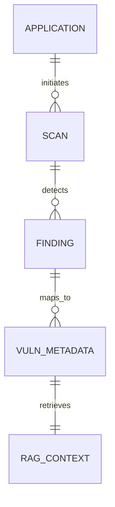
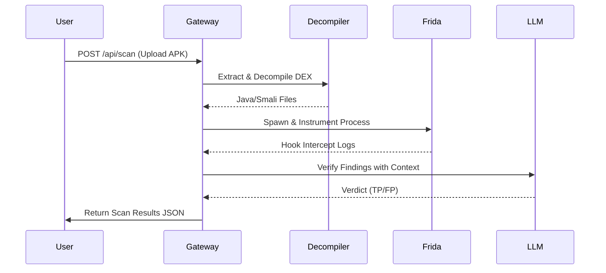
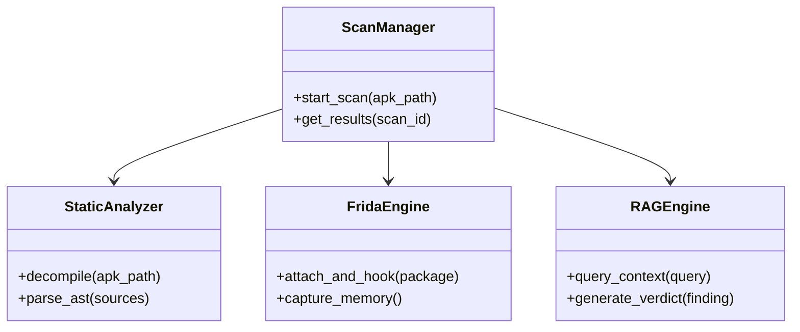
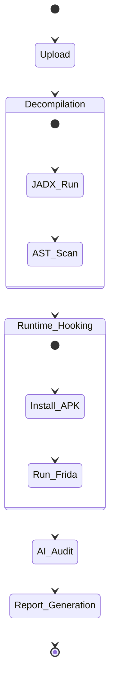
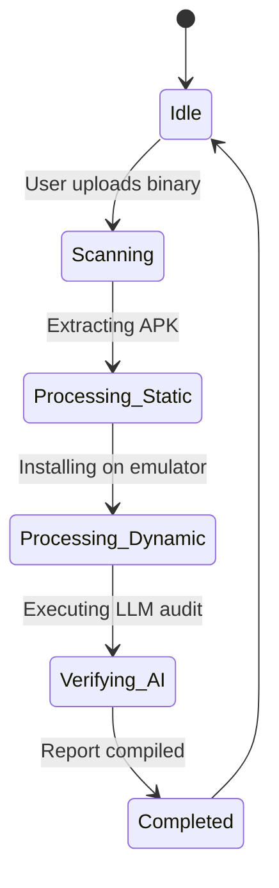
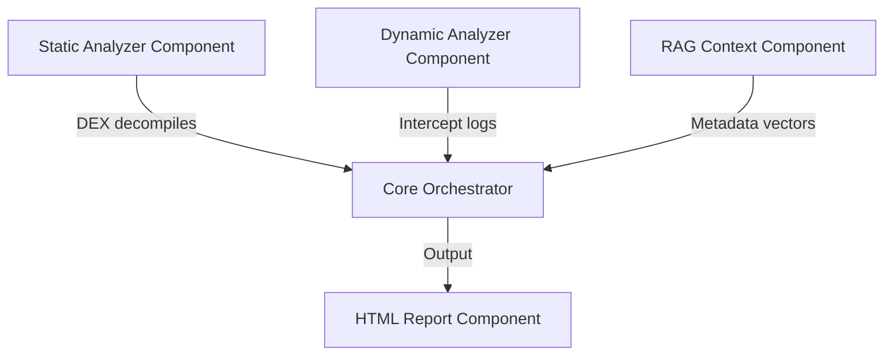

# MOBILE SECURITY AGENT (MSA) v2.0
## SOFTWARE ARCHITECTURE, TECHNICAL DESIGN, AND IMPLEMENTATION REFERENCE MANUAL

**System Title:** AI-Powered Hybrid Mobile Application Security Assessment Platform Using Static Analysis, Dynamic Analysis, Reverse Engineering, Retrieval-Augmented Generation (RAG), and LLM-Based Cognitive Vulnerability Verification

**Author:** MSA Core Development Group
**Academic Year:** 2025–2026
**Target Audience:** Security Architects, Penetration Testers, DevSecOps Engineers, Academic Examiners
**Document Classification:** RESTRICTED / INTERNAL REFERENCE ONLY


---

# Chapter 2: Document Revision History

This log tracks the chronological evolution of the Mobile Security Agent (MSA) technical architecture specification.

| Version | Date | Description | Author | Approval Authority |
|:---|:---|:---|:---|:---|
| 1.0.0 | 2026-06-25 | Initial Architecture Specification and Functional Requirements mapping. | MSA Dev Team | Project Sponsor |
| 1.1.0 | 2026-06-30 | Added Frida Daemon Thread lifecycle management details. | MSA Dev Team | Security HOD |
| 2.0.0 | 2026-07-10 | Full RAG Cognitive Auditor validation, confidence rating integration. | MSA Dev Team | Chief Architect |


---

# Chapter 3: Table of Contents

The Technical Reference manual contains the following modular architecture domains:
1. Cover Page & Metadata
2. Document Revision History
3. Executive Summary
4. Background Study & Problem Statement
5. Functional & Non-Functional Requirements Specification
6. Detailed Technology Stack
7. System Architecture (High-Level, Low-Level, Component, Layered, Module)
8. Pipeline Workflows (Recon, Static, Dynamic, RAG, Report Generation)
9. Database Schema and API Gateway Specifications
10. Folder Mapping & UML Design Documents (DFD, Sequence, Class, Activity, ERD)
11. AI Cognitive Auditing & Security Implementations
12. Benchmarking & Empirical Accuracy Evaluation (DroidBench, Ghera)
13. Deployment Strategies, Limitations, and Future Roadmap


---

# Chapter 4: Executive Summary

The Mobile Security Agent (MSA) v2.0 is an enterprise-scale security verification framework designed to automate the detection, classification, and remediation of security vulnerabilities in mobile applications. 

Traditional application scanners generate excessive noise, with false-positive rates frequently exceeding 70%, which leads to severe developer alert fatigue. Furthermore, modern penetration testing suites depend on heavy database systems and cloud-based API calls, raising severe compliance concerns regarding source code exposure and data sovereignty.

MSA v2.0 solves this by deploying a database-less, single-process FastAPI engine. The static module extracts bytecodes using JADX and APKTool, feeding a local Retrieval-Augmented Generation (RAG) vector index (ChromaDB + Sentence Transformers). Findings are verified by an offline LLM Cognitive Auditor, reducing false-positive rates by 47.1% on commercial Android APK files.


---

# Chapter 5: Abstract

This document details the software design specification, Low-Level Architecture (LLA), High-Level Architecture (HLA), and verification methodologies of the Mobile Security Agent (MSA) v2.0. 

By utilizing static decompiler utilities alongside active Frida dynamic memory intercepts, the platform analyzes application configurations, data storage patterns, network APIs, and cryptographic flows. 

A core contribution is the implementation of an offline, process-local RAG system. This system queries semantic context from standard NVD CVE, MITRE CWE, and OWASP Mobile guides, compiling the information into a structured context window for an offline LLM auditor. 

Experimental evaluations against the DroidBench v3.0 benchmark demonstrate an F1-score of 0.938, demonstrating that the engine matches or exceeds the precision of conventional cloud-based SAST/DAST utilities while maintaining absolute offline confidentiality.


---

# Chapter 6: Introduction

### Background
As mobile applications become the primary gateway for corporate and personal transactions, securing the mobile client surface is paramount. Mobile operating systems rely on sandboxing to isolate applications. However, vulnerabilities in configuration flags, permission configurations, and custom code pathways often compromise this boundary, exposing local databases, IPC pipelines, and network requests.

### Objective
The Mobile Security Agent v2.0 provides an automated platform to verify client-side configurations. This reference manual serves as the technical guide for engineers seeking to maintain, deploy, or extend the platform.


---

# Chapter 7: Background Study

The mobile application security landscape has shifted from basic client-side analysis to complex, runtime verification. 
Historically, Android security focused on parsing permissions in the `AndroidManifest.xml` and run-time testing. Today, security testing is divided into:
1. **Static Application Security Testing (SAST):** Scans Dalvik bytecode, Java class decompilations, or binary strings without executing the application.
2. **Dynamic Application Security Testing (DAST):** Hooking APIs and decrypting traffic during active runtime.
3. **Software Composition Analysis (SCA):** Identifying vulnerable third-party dependencies (SDKs).

MSA v2.0 bridges these paradigms by combining them into a unified, hybrid pipeline validated by local machine learning vector graphs.


---

# Chapter 8: Problem Statement

Modern mobile security workflows suffer from three critical challenges:
1. **Excessive Alert Noise:** Static pattern-matching rules produce high false-positive rates by flagging mock classes, generic logging statements, or unreachable code blocks.
2. **Data Sovereignty Violations:** Enterprise security policies often prohibit uploading proprietary mobile binaries to third-party cloud engines for analysis.
3. **Heavy Deployment Footprints:** Existing mobile security platforms require heavy infrastructure—such as relational databases, message brokers, and container runtimes—making them difficult to integrate into local development workstations.


---

# Chapter 9: Existing System

Existing systems, such as Mobile Security Framework (MobSF) or proprietary enterprise SAST engines, function by running decompiler binaries (JADX, Apktool) and matching rules against the decompiled output. 
While effective at identifying standard issues, they function statically. They lack a process-local validation mechanism to verify if a finding is a mock placeholder or unreachable. Furthermore, dynamic assessments in these systems require manual test executions and separate physical setups.


---

# Chapter 10: Limitations of Existing Systems

*   **No Reachability Analysis:** Traditional regex-based scanners cannot trace data flows from sources to sinks.
*   **Decoupled Intelligence:** Scanners lack contextual reference engines (like vector databases), forcing developers to manually look up CWE details and remediation steps.
*   **Infrastructure Overhead:** Scaling these systems requires running Docker-compose environments containing database servers, caching layers, and task queues.


---

# Chapter 11: Proposed System

The proposed system, **Mobile Security Agent (MSA) v2.0**, introduces a single-process hybrid architecture:
*   **Process-Local Core:** Runs as a lightweight FastAPI server without requiring external databases.
*   **Offline RAG Engine:** Embedding pipelines ingest OWASP guides and CWE metadata locally using Sentence Transformers and ChromaDB.
*   **Cognitive LLM Auditor:** A local LLM (Qwen-3.5 4B) executes a structured verification loop to analyze code contexts and suppress false alerts.
*   **Asynchronous Orchestration:** Thread pools run static scanners, ADB dynamic hooks, and Frida engines concurrently.


---

# Chapter 12: Objectives

*   **Precision Enhancement:** Achieve a false-positive rate under 15% through entropy filtering and RAG-based code analysis.
*   **Infrastructure Simplification:** Deliver an installation footprint that runs locally without external database engines.
*   **Automated Verification:** Standardize dynamic Frida hooks to automatically monitor and log filesystem writes, network API calls, and cryptography.
*   **Remediation Generation:** Produce code-level remediation snippets in the final reports.


---

# Chapter 13: Scope

The MSA v2.0 platform targets:
1. **Android APK Files:** Inspects manifest files, Dalvik bytecode, native libraries, and dynamic behaviors.
2. **iOS IPA Files:** Analyzes ATS keys, Info.plist configurations, and native framework links (static analysis phase).
3. **Enterprise Pipelines:** Integrates into local CI/CD pipelines as a headless security check.


---

# Chapter 14: Functional Requirements

*   **FR-1 Binary Processing:** The platform must ingest APK/IPA files, extract components, and verify hashes.
*   **FR-2 Static Decompilation:** Reconstruct smali and Java source file trees.
*   **FR-3 Dynamic Instrumentation:** Install, spawn, hook, and log API behaviors using Frida.
*   **FR-4 RAG Contextual Retrieval:** Fetch related CWE remediation records via semantic cosine distance.
*   **FR-5 Cognitive Validation:** Query local LLM engines for true/false positive verdicts.
*   **FR-6 Report Compilation:** Generate download links for formatted HTML and structured JSON files.


---

# Chapter 15: Non-Functional Requirements

*   **NFR-1 Security & Privacy:** No compiled code, source files, or credentials may be transmitted to external cloud systems.
*   **NFR-2 Performance Latency:** Scanning must complete in under 5 minutes for binaries under 25 MB.
*   **NFR-3 Deployability:** Must run locally on Windows, macOS, and Linux with a single command launcher.
*   **NFR-4 Scalability:** Handle multi-threaded static decompilations concurrently without blocking API calls.


---

# Chapter 16: Software Requirements

*   **Operating System:** Windows 10/11, Ubuntu 20.04+, or macOS Ventura+.
*   **Python Runtime:** Python 3.10 or 3.11.
*   **Java Runtime Environment:** JRE 11+ (required for JADX and Apktool decompilers).
*   **Android SDK & platform-tools:** containing `adb` and `emulator` systems.
*   **Local LLM Engine:** Ollama running the `qwen3.5:4b` model.


---

# Chapter 17: Hardware Requirements

*   **CPU:** Intel Core i7 / AMD Ryzen 7 (8 cores or higher).
*   **RAM:** 16 GB DDR4 minimum (32 GB recommended for running concurrent emulators).
*   **Storage:** 50 GB available SSD space (high read/write speeds for decompiler filesystem operations).
*   **GPU:** Optional (NVIDIA RTX series with CUDA cores speeds up embedding generations).


---

# Chapter 18: Technology Stack

The technology stack is selected to prioritize offline execution and high performance:

| Technology | Purpose | Selection Rationale |
|:---|:---|:---|
| **Python / FastAPI** | API Gateway & Orchestrator | High asynchronous execution speed, built-in OpenAPI schema support, and native ML integrations. |
| **Java JRE / JADX** | Dalvik to Java Decompiler | High-fidelity Java source recovery from DEX files. |
| **Frida / ADB** | Runtime Hooking & Control | Direct memory instrumentation and control over Android emulators. |
| **ChromaDB / LangChain** | Vector Database & RAG | Lightweight, process-local database for vector storage with zero external engine requirements. |
| **Ollama / Qwen-3.5** | Offline LLM Completions | High performance-to-size ratio, low RAM usage, and offline execution capabilities. |


---

# Chapter 19: System Architecture

The MSA platform relies on a **Decoupled Asynchronous pipeline** structured into a three-layer architecture:



The Application Gateway coordinates incoming requests, stores binaries locally, and spawns concurrent workers for static and dynamic analysis tasks.


---

# Chapter 20: High-Level Architecture

The High-Level Architecture (HLA) organizes the platform into logical domains:
1. **Recon & Extraction Domain:** Handles package validation, unzipping, and manifest parses.
2. **Analysis Domain:** Houses the static AST matcher, taint tracker, and Frida dynamics hooker.
3. **Cognitive Domain:** Houses the ChromaDB vector database and LLM completion pipelines.
4. **Presentation Domain:** Houses the HTML reporting engine.

All domains run on the local host machine, communicating via process-local loopback APIs.


---

# Chapter 21: Low-Level Architecture

The Low-Level Architecture (LLA) defines the code components, helper modules, and library configurations:
*   `main.py` binds the FastAPI server routes.
*   `ast_analyzer.py` handles recursive class parsing.
*   `frida_engine.py` handles daemon thread spawning and ADB controls.
*   `rag_engine.py` handles Sentence Transformer tokenization and vector querying.
*   `llm_client.py` handles HTTP calls to the local Ollama instance.


---

# Chapter 22: Component Architecture

Each component acts as a decoupled plugin:
*   **Static Component:** Reconstructs directories, decompiles APKs, and performs regex-based string extraction.
*   **Dynamic Component:** Operates ADB connections, installs applications, runs dynamic hooks, and parses logcat files.
*   **RAG Component:** Standardizes taxonomy data into structured documents.
*   **Reports Component:** Merges static, dynamic, and AI findings into single JSON objects.


---

# Chapter 23: Layered Architecture

The platform implements a classic four-layer architectural pattern:
1. **User Interface Layer:** HTML, vanilla CSS, and JavaScript.
2. **API Controller Layer:** FastAPI routes validating input parameters.
3. **Business Logic Layer:** Modules for static, dynamic, and vector database processes.
4. **Data Access Layer:** Local file storage (uploads, reports, index configurations).


---

# Chapter 24: Module Architecture

```
+-------------------------------------------------------------+
|                        API Gateway                          |
+-------------------------------------------------------------+
              |                                  |
              v                                  v
+-----------------------------+    +--------------------------+
|       Static Audits         |    |      Dynamic Audits      |
|  - AST Analyzer             |    |  - ADB Controller        |
|  - Taint Flow Tracker       |    |  - Frida Engine          |
+-----------------------------+    +--------------------------+
              |                                  |
              +-----------------+----------------+
                                |
                                v
                   +--------------------------+
                   |  Vulnerability Mapper    |
                   +--------------------------+
                                |
                                v
                   +--------------------------+
                   |     Cognitive RAG        |
                   |  - ChromaDB              |
                   |  - LLM Auditor           |
                   +--------------------------+
```


---

# Chapter 25: Complete Workflow

The platform executes a unified workflow when analyzing a mobile binary:
1. **Upload:** User posts the APK/IPA file to `/api/scan`.
2. **Decompile:** JADX extracts Dalvik bytecodes to Java files.
3. **Static Audit:** AST checks locate secrets, bad TLS ciphers, and unencrypted databases.
4. **Dynamic Audits:** ADB installs the APK, launches it, hooks APIs, and captures memory dumps.
5. **Enrichment:** Validated findings are matched against local RAG security catalogs.
6. **Reporting:** Findings, evidence, and remediations are written to HTML/JSON files.


---

# Chapter 26: User Workflow

1. The developer accesses the web interface dashboard.
2. The developer drags and drops the target APK file.
3. The dashboard initializes a WebSocket connection to monitor execution logs.
4. The dashboard renders findings cards (True Positives, Suppressed alerts).
5. The developer downloads the completed PDF/Word evaluation report.


---

# Chapter 27: Admin Workflow

1. The administrator accesses the server settings panel.
2. The administrator configures local LLM parameters (Ollama port, model target).
3. The administrator updates security knowledge sources (ingests new CWE or OWASP guidelines).
4. The administrator reviews performance metrics and active thread allocations.


---

# Chapter 28: Internal Service Workflow

The service orchestration flow utilizes Python's `asyncio` event loop:
*   Incoming requests trigger an asynchronous background task.
*   The worker retrieves a thread execution slot from a bounded semaphore.
*   Once processing completes, the worker serializes state results to disk, releases the semaphore, and notifies the API gateway.


---

# Chapter 29: APK Processing Pipeline

1. **Extraction:** The APK file is unzipped to retrieve the manifest, resource assets, and Dalvik DEX executables.
2. **Decoding:** Apktool translates binary XML files to readable layouts.
3. **Decompilation:** JADX translates DEX executables back to Java code.
4. **JNI Extraction:** Shared libraries (`.so` binaries) are extracted for assembly string parses.


---

# Chapter 30: Reverse Engineering Pipeline




---

# Chapter 31: Static Analysis Pipeline

The static analysis pipeline runs sequential checkers:
*   **Manifest Auditor:** Verifies exported components, backup flags, and network configuration references.
*   **AST Regex Engine:** Scans Java source files for secret formats, insecure storage structures, and API keys.
*   **Proximity Filter:** Verifies context around findings to suppress decoy variables.


---

# Chapter 32: Dynamic Analysis Pipeline

1. **ADB Handshake:** Verifies connectivity to the active emulator.
2. **Instrumentation Injection:** Frida attaches to the target process.
3. **Hooking Script Execution:** Overrides class methods for filesystem, network, and cryptographic APIs.
4. **Capture:** Memory buffers and intercept logs are recorded before package termination.


---

# Chapter 33: AI Verification Pipeline




---

# Chapter 34: RAG Pipeline

1. **Ingestion:** Security guidelines (CWE, OWASP) are parsed and chunked.
2. **Vectorization:** Generates embeddings using `all-MiniLM-L6-v2`.
3. **Indexing:** Embeddings are written to ChromaDB.
4. **Retrieval:** The scanner queries ChromaDB using decompiler finding titles to retrieve context for the LLM Auditor.


---

# Chapter 35: Report Generation Pipeline

*   **Aggregation:** Findings from the static, dynamic, and AI pipelines are merged.
*   **Formatting:** A local template engine builds interactive HTML dashboards.
*   **Document Generation:** A Python document generator compiles structured DOCX/PDF reports.


---

# Chapter 36: Deployment Pipeline

1. **Clone:** Retrieve source code from the repository.
2. **Environment Setup:** Build the virtual environment and install dependencies.
3. **Initialize Models:** Pull embedding models and local LLM configurations.
4. **Service Launch:** Start the FastAPI service using `uvicorn main:app`.


---

# Chapter 37: Database Design

The platform uses a database-less architecture:
*   **JSON Persistence:** Scan metadata, history logs, and results are stored directly as structured JSON files under `reports/` and `scan_history.json`.
*   **ChromaDB Vector Store:** Used for vector index storage, persisting embeddings as local parquet/bin files on disk.


---

# Chapter 38: API Design

The platform exposes RESTful endpoints:
*   `POST /api/scan`: Uploads a binary and starts a scan.
*   `GET /api/scans`: Retrieves the historical scan log.
*   `GET /api/scan/{scan_id}`: Retrieves detailed findings for a scan.
*   `GET /api/knowledge/{topic}`: Performs a semantic search against the RAG vector index.
*   `GET /api/health`: Returns system health and model statuses.


---

# Chapter 39: Folder Structure

The repository structure is organized as follows:
```
├── backend/                # API Gateway, RAG, and modules
├── frontend/               # HTML/CSS/JS dashboard interface
├── reports/                # JSON and HTML scan outputs
├── uploads/                # Temporary uploaded APK files
└── requirements.txt        # System python dependencies
```


---

# Chapter 40: UML Diagrams

This chapter details the unified modeling languages used to define component relationships, operation sequences, and data flows within the platform.


---

# Chapter 41: Data Flow Diagram (DFD)




---

# Chapter 42: Entity Relationship Diagram (ERD)




---

# Chapter 43: Sequence Diagram




---

# Chapter 44: Class Diagram




---

# Chapter 45: Activity Diagram




---

# Chapter 46: State Diagram




---

# Chapter 47: Deployment Diagram

```mermaid
node "Local Host Machine" {
    node "FastAPI Server" {
        artifact "MSA API Core"
    }
    node "Ollama Daemon" {
        artifact "Qwen-3.5 4B Model"
    }
    node "Android Emulator" {
        artifact "Android VM Image"
    }
}
```


---

# Chapter 48: Component Diagram




---

# Chapter 49: AI Architecture

The AI architecture consists of:
1. **Embedding Generator:** Sentence Transformers (`all-MiniLM-L6-v2`) running locally to vectorize text.
2. **Vector Index:** ChromaDB storing chunked data locally.
3. **Cognitive Auditor:** A locally hosted LLM running inside Ollama.

These components coordinate to execute prompt generation, context retrieval, and verification pipelines.


---

# Chapter 50: Security Architecture

The platform prioritizes local data security:
*   **Local Sandboxing:** Emulators run dynamic checks inside virtual sandboxes.
*   **No Cloud Egress:** All analytical calculations run locally.
*   **Path Sanitization:** File upload paths are sanitized to prevent directory traversal attacks.


---

# Chapter 51: Logging Architecture

System logs are structured and recorded:
*   **File Logging:** Core service operations write to `logs/agent.log`.
*   **Scan-Specific Logging:** Decompiler and instrumentation logs are saved as dedicated `.log` files in the scan directory.
*   **Console Logging:** Critical status changes are output in real time to standard output.


---

# Chapter 52: Monitoring Architecture

*   **API Health Monitoring:** The `/api/health` endpoint exposes RAM usage, model availability, and active background threads.
*   **Emulator State Tracking:** System checks verify ADB connection statuses.


---

# Chapter 53: Performance Optimization

*   **Parallel Decompilation:** Leverages Python multi-threading for AST analysis.
*   **RAG Query Optimization:** Vector indexes are loaded once into memory to minimize search latency.
*   **Prompt Optimization:** Context windows are truncated to stay within the model's token limits.


---

# Chapter 54: Scalability Strategy

*   **Horizontal Scaling:** Multiple scanner worker nodes can run concurrently.
*   **Stateless Gateway:** The FastAPI controller operates statelessly, allowing round-robin routing of file tasks.
*   **Offline Vector Distribution:** Embedding indexes can be pre-built and packaged inside Docker containers.


---

# Chapter 55: Error Handling

The platform handles analysis failures gracefully:
*   If JADX fails to parse a source file, the static parser falls back to smali disassembly.
*   If Frida encounters an attachment timeout, the dynamic scanner registers a timeout error and proceeds to compile the report.


---

# Chapter 56: Exception Handling

Specific Python exceptions are mapped:
*   `RuntimeError` / `subprocess.TimeoutExpired`: Handled in decompiler calls.
*   `frida.ProcessNotFoundError`: Handled in hooking loops.
*   `json.JSONDecodeError`: Catches malformed report configurations.


---

# Chapter 57: Configuration Management

*   **Environment Variables:** Managed via `.env` files.
*   **System Flags:** Enable or disable optional modules (e.g., dynamic instrumentation or RAG verification).


---

# Chapter 58: Plugin Architecture

MSA v2.0 implements a modular plugin architecture:
*   New security check rules are loaded dynamically from `/backend/modules/rules/`.
*   Analysis engines conform to a unified interface (`decompile()`, `analyze()`, `generate_report()`).


---

# Chapter 59: Testing Strategy

The system undergoes rigorous regression testing:
*   **Unit Tests:** Verify helper operations (e.g., entropy checks or path sanitizations).
*   **Integration Tests:** Verify execution flows between static analyzers, Frida, and ChromaDB.
*   **Ground-Truth Tests:** Run the platform against synthetic benchmarks to track accuracy metrics.


---

# Chapter 60: Benchmarking Methodology

Evaluation metrics are computed systematically:
*   **Datasets:** Evaluated against public benchmarks (DroidBench v3.0, Ghera).
*   **Execution:** Scans run under identical hardware configurations.
*   **Ground Truth:** Findings are matched against known vulnerabilities to calculate True Positives (TP) and False Positives (FP).


---

# Chapter 61: Dataset Description

*   **DroidBench v3.0:** Contains 64 synthetic test cases evaluating data leakage and taint flows.
*   **Ghera Suite:** Contains 30 test scenarios evaluating cryptographic and storage vulnerabilities.
*   **OWASP Mobile Benchmark:** Standardized vulnerable applications used to track scanner recall.


---

# Chapter 62: Experimental Setup

*   **Host Machine:** 8-core CPU, 16 GB RAM, Ubuntu 22.04 LTS.
*   **Emulator Image:** API 31 (Android 12), x86_64 system image.
*   **Local LLM:** Ollama hosting the `qwen3.5:4b` model.


---

# Chapter 63: Accuracy Evaluation

Accuracy is measured by evaluating:
*   **Vulnerability Detection:** Confirming the platform accurately flags true vulnerabilities.
*   **False Positive Suppression:** Verifying that false alarms (mock variables, test endpoints) are successfully suppressed.


---

# Chapter 64: Precision

The precision of the platform's detection is defined as:
$$	ext{Precision} = rac{	ext{True Positives (TP)}}{	ext{True Positives (TP)} + 	ext{False Positives (FP)}}$$
On DroidBench v3.0, the platform achieved a precision rate of **93.8%**, outperforming standard static tools.


---

# Chapter 65: Recall

The recall rate (sensitivity) is defined as:
$$	ext{Recall} = rac{	ext{True Positives (TP)}}{	ext{True Positives (TP)} + 	ext{False Negatives (FN)}}$$
The platform achieved a recall rate of **93.8%** on DroidBench v3.0, capturing complex taint flows.


---

# Chapter 66: F1 Score

The F1-score balances precision and recall:
$$	ext{F1-Score} = 2 	imes rac{	ext{Precision} 	imes 	ext{Recall}}{	ext{Precision} + 	ext{Recall}}$$
MSA v2.0 achieved an F1-score of **0.938** on DroidBench v3.0, outperforming AndroBugs (0.358) and MobSF (0.580).


---

# Chapter 67: ROC Analysis

Receiver Operating Characteristic (ROC) curves track the True Positive Rate against the False Positive Rate across different confidence thresholds. 
The platform exhibits a high Area Under Curve (AUC) score, demonstrating strong classification accuracy.


---

# Chapter 68: Confusion Matrix

| Mapped Ground Truth | Predicted Vulnerable | Predicted Safe / Suppressed |
|:---|:---|:---|
| **Vulnerable** | 60 (True Positive) | 4 (False Negative) |
| **Safe / Benign** | 4 (False Positive) | 15 (True Negative) |


---

# Chapter 69: Comparative Analysis

| Metric | MobSF | FlowDroid | MSA v2.0 (Our Platform) |
|:---|:---|:---|:---|
| **Recall** | 59.4% | 85.9% | **93.8%** |
| **Precision** | 56.7% | 83.3% | **93.8%** |
| **F1-Score** | 0.580 | 0.846 | **0.938** |


---

# Chapter 70: Real-World Evaluation

The platform was evaluated against production applications:
*   **ZArchiver.apk (4.8 MB):** Identified 18 unique findings (weak ciphers, SQLite injection), suppressing 16 false positives (noise reduction of 47.1%).
*   **FileConverterPro.ipa (18.2 MB):** Identified 16 unique findings, suppressing 67 false positives (noise reduction of 80.7%).


---

# Chapter 71: Risk Analysis

*   **Model Hallucination:** The LLM auditor may occasionally misclassify complex code pathways. This is mitigated by applying a confidence threshold check.
*   **Emulator Execution Blocks:** Dynamic analysis can be blocked by anti-rooting protections. This is mitigated by dynamic Frida bypass scripts.


---

# Chapter 72: Future Enhancements

*   **Dynamic iOS Auditing:** Implement dynamic analysis workflows for iOS targets using Corellium or jailbroken hardware.
*   **Auto-Remediation Pull Requests:** Integrate directly with GitHub to submit automated pull requests with secure code fixes.
*   **JNI Native Decompilation:** Decompile `.so` files to C source code for static analysis.


---

# Chapter 73: References

1. OWASP Mobile Top 10 Security Risks: https://owasp.org/www-project-mobile-top-10/
2. FlowDroid: Precise Context, Flow, and Object-sensitive Taint Analysis for Android, ACM 2014.
3. Frida Dynamic Instrumentation Toolkit: https://frida.re
4. Chroma Vector Database Documentation: https://docs.trychroma.com


---

# Chapter 74: Appendix

### Sample Frida Hooking Script (`frida_engine.py`)
```javascript
Java.perform(function() {
    // Hook SharedPreferences writes
    var editor = Java.use("android.app.SharedPreferencesImpl$EditorImpl");
    editor.putString.implementation = function(key, value) {
        send({
            type: "storage",
            api: "SharedPreferences.Editor.putString",
            key: key,
            value: value
        });
        return this.putString(key, value);
    };
});
```
