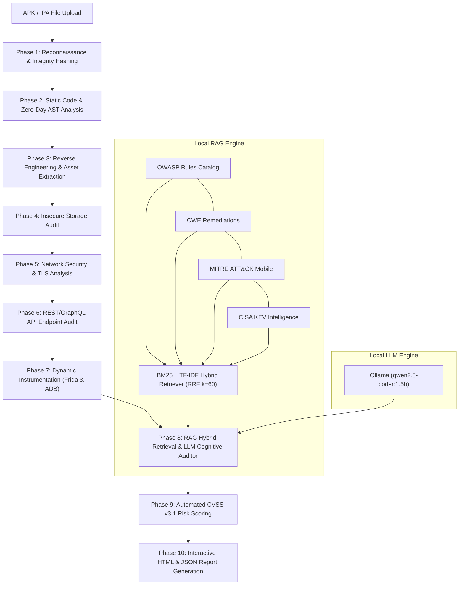

# 🛡️ LLM-Powered Autonomous Mobile Application Security Penetration Testing Platform (MSA v2.0)

[](https://www.gnu.org/licenses/gpl-3.0)
[](https://www.python.org/)
[](https://fastapi.tiangolo.com/)
[](https://ollama.com/)
[](#-the-10-phase-security-pipeline)
[](#-rag-engine--knowledge-base-data)
[](#-vulnerability-detection-matrix--rules)
[](#-system-specifications--technical-data)

> **Mobile Security Agent (MSA v2.0)** is an autonomous, privacy-preserving mobile application penetration testing and vulnerability auditing platform. It combines a **10-phase automated security analysis pipeline** with an **in-memory hybrid Retrieval-Augmented Generation (RAG) engine** (BM25 + TF-IDF with Reciprocal Rank Fusion) and **localized LLM cognitive reasoning** to detect, verify, score, and remediate Android and iOS weaknesses with zero cloud dependencies.

---

## 📑 Table of Contents

- [Key Capabilities](#-key-capabilities)
- [System Architecture](#-system-architecture)
- [System Specifications & Technical Data](#-system-specifications--technical-data)
- [The 10-Phase Security Pipeline](#-the-10-phase-security-pipeline)
- [Vulnerability Detection Matrix & Rules](#-vulnerability-detection-matrix--rules)
- [RAG Engine & Knowledge Base Data](#-rag-engine--knowledge-base-data)
- [Frontend Web Application & Dashboard](#-frontend-web-application--dashboard)
- [Quickstart & Installation](#-quickstart--installation)
  - [Prerequisites](#prerequisites)
  - [1-Click Windows Launchers](#1-click-windows-launchers)
  - [Manual CLI Setup](#manual-cli-setup)
- [Global Access via Cloudflare Tunnel](#-global-access-via-cloudflare-tunnel)
- [REST API Reference](#-rest-api-reference)
- [Project Structure](#-project-structure)
- [License & Disclaimer](#-license--disclaimer)

---

## ✨ Key Capabilities

- **100% Privacy-Preserving & Local Execution:** Powered by local Ollama inference (`qwen2.5-coder:1.5b` or custom models). Application binaries, decompiled bytecode, and proprietary secrets never leave the host system.
- **Automated 10-Phase Micro-Pipeline:** Executes reconnaissance, AST taint tracking, multi-tier decompilation, storage audits, TLS/SSL validations, API endpoint testing, dynamic Frida hooking, RAG mapping, CVSS scoring, and reporting.
- **Hybrid Retrieval-Augmented Generation (RAG v3.0):** Employs dual lexical retrieval (**Okapi BM25** and **TF-IDF**) fused via **Reciprocal Rank Fusion ($k=60$)**, grounded on 1,140+ vetted vulnerability reference documents and 1,248 knowledge graph taxonomy edges.
- **Cognitive False-Positive Filtering:** Evaluates raw regex pattern matches through an LLM Semantic Auditor that inspects enclosing code context, sanitization routines, and framework defenses to suppress false alarms.
- **Multi-Engine Decompilation Fallback:** Resilient bytecode decompilation pipeline (Jadx $\rightarrow$ APKTool $\rightarrow$ pure-Python Androguard fallback), ensuring analysis continues even on heavily obfuscated applications.
- **Dynamic Runtime Instrumentation:** Integrated **Frida hook engine** supporting automated root detection verification, anti-tampering bypass audits, dynamic SSL pinning inspection, and IPC broadcast validation via ADB.
- **Deterministic CVSS v3.1 Scoring:** Derives vector-based CVSS metrics across Attack Vector, Attack Complexity, Privileges Required, User Interaction, Scope, and Confidentiality/Integrity/Availability impacts.
- **Actionable Remediation Code Patches:** Generates drop-in source code diffs (Java, Kotlin, Swift, or Android XML) demonstrating both the vulnerable construct and the secure implementation.
- **Real-Time Security Dashboard:** Responsive cybersecurity web interface featuring live log streaming, multi-phase progress visualization, historical scan telemetry, and one-click HTML/JSON report exports.

---

## 🏗️ System Architecture



---

## ⚙️ System Specifications & Technical Data

| System Parameter | Specification / Technical Metric |
| :--- | :--- |
| **Backend Framework** | FastAPI (v0.109.0+) with Uvicorn ASGI asynchronous worker event loop |
| **Supported File Formats** | Android Package (`.apk`), Android App Bundle (`.aab`), iOS App Archive (`.ipa`) |
| **Target OS Support** | Android 5.0 (API Level 21) through Android 15 (API Level 35); iOS 12.0+ |
| **Average End-to-End Scan Time** | ~47.3 seconds per application package on commodity CPU hardware |
| **Decompilation Pipeline** | Tier 1: Jadx (Java Source) ➔ Tier 2: APKTool (Smali/XML) ➔ Tier 3: Pure-Python Androguard |
| **AST Analysis Engine** | `javalang` AST node visitor for control flow and taint sink tracking |
| **Dynamic Instrumentation** | Frida Core runtime injection via Python bindings + ADB subprocess daemon |
| **Database Architecture** | Database-less JSON flat-file storage (Zero external SQL server dependency) |
| **Historical Scans Capacity** | Flat-file structured JSON repository (`reports/` and `scan_history.json`) |
| **Memory Footprint** | ~350 MB idle / ~1.2 GB peak during full multi-DEX decompilation and AST parsing |
| **LLM Inference Engine** | Local Ollama instance running `qwen2.5-coder:1.5b` (FP16 / 4-bit GGUF quantization) |
| **LLM Execution Mode** | 100% Host-confined, CPU/GPU accelerated, zero internet data transmission |
| **Network Interface** | Local loopback `http://127.0.0.1:8000` + Cloudflare HTTP/2 TLS tunnel over port 443 |

---

## 🔍 The 10-Phase Security Pipeline

| Phase | Module Name | Primary Functions | Target Standards |
| :---: | :--- | :--- | :--- |
| **01** | **Reconnaissance** | File integrity SHA-256/MD5 hashing, min/target SDK versions, exported component enumeration, dangerous Android permissions. | M1, M9 |
| **02** | **Static & AST Analysis** | Javalang AST traversal, taint tracking, hardcoded credentials, weak cryptography, reflection audit, zero-day heuristic patterns. | M5, M7, CWE-798 |
| **03** | **Reverse Engineering** | DEX decompilation (Jadx/APKTool/Androguard), smali parsing, hidden URL scraping, internal asset extraction, secret pattern matching. | M9, CWE-693 |
| **04** | **Storage Security** | SQLite database audits, Shared Preferences plaintext checking, world-readable file permissions (`MODE_WORLD_READABLE`), Android Keystore validation. | M2, CWE-276, CWE-312 |
| **05** | **Network Security** | Cleartext HTTP traffic configurations, permissive `TrustManager` implementations, disabled hostname verifiers, SSL pinning integrity checks. | M3, CWE-295, CWE-319 |
| **06** | **API Security** | REST/GraphQL endpoint detection, missing authentication schemes, sensitive token exposure, API parameter tampering vectors. | OWASP API Top 10 |
| **07** | **Dynamic Instrumentation** | Automated Frida runtime hook scripts, root detection bypass analysis, anti-tampering verification, IPC broadcast testing via ADB. | M8, M9, MASVS-RESILIENCE |
| **08** | **RAG Vuln Mapping** | Hybrid BM25/TF-IDF retrieval, knowledge graph taxonomy traversal, LLM cognitive false-positive filtering. | CWE, CAPEC, CVE, KEV |
| **09** | **Risk Assessment** | CVSS v3.1 base score computation, exploitability metrics calculation, aggregate application security posture scoring. | FIRST CVSS v3.1 |
| **10** | **Report Generation** | Interactive dark-mode HTML executive reports, raw JSON dumps, developer remediation code patches with before/after comparisons. | DevSecOps & Compliance |

---

## 🛡️ Vulnerability Detection Matrix & Rules

The platform scans for vulnerabilities categorized across international security taxonomies:

### 1. OWASP Mobile Top 10 (2024)
- **M1: Improper Platform Usage:** Exported Activities/Receivers/Services without permissions, Content Provider SQLi, PendingIntent hijacking.
- **M2: Insecure Data Storage:** Cleartext credentials in SharedPreferences, unencrypted SQLite databases, world-readable files (`CWE-276`), sensitive data in Logcat.
- **M3: Insecure Communication:** Cleartext HTTP traffic (`android:usesCleartextTraffic="true"`), broken TLS/SSL validation, permissive `TrustManager` (`CWE-295`), missing certificate pinning.
- **M4: Insecure Authentication:** Flawed biometric authentication schemes, hardcoded tokens, client-side session validation.
- **M5: Insufficient Cryptography:** Deprecated ciphers (DES, 3DES, RC4, Blowfish, MD5, SHA-1), static encryption IVs, ECB mode AES (`CWE-327`).
- **M6: Insecure Authorization:** Broken access control in exported IPC interfaces, missing privilege checks.
- **M7: Client Code Quality:** Unsafe reflection, format string bugs, buffer overflow patterns in JNI native libraries, memory leaks.
- **M8: Code Tampering:** Lack of binary integrity checks, missing signature verification, absence of anti-debugging controls.
- **M9: Reverse Engineering:** Obfuscation absence (ProGuard/R8), plaintext strings, exposed API endpoints and internal URLs.
- **M10: Extraneous Functionality:** Hidden developer backdoors, test activities, debug configurations (`android:debuggable="true"`).

### 2. OWASP API Security Top 10 (2023)
- **API1: Broken Object Level Authorization (BOLA):** Direct object references exposed in client-side query parameters.
- **API2: Broken Authentication:** API keys and static bearer tokens hardcoded into mobile binaries.
- **API3: Broken Object Property Level Authorization:** Mass assignment flaws in REST API payloads.
- **API4: Unrestricted Resource Consumption:** Unthrottled API endpoint calls without rate-limiting controls.
- **API7: Server-Side Request Forgery (SSRF):** Unvalidated URL parameters passed from mobile client to backend handlers.
- **API8: Security Misconfiguration:** Overly permissive CORS headers, exposed GraphQL introspection schemas.

### 3. Common Weakness Enumeration (CWE) Catalogs
- Covered CWEs include: `CWE-20`, `CWE-78`, `CWE-89`, `CWE-200`, `CWE-276`, `CWE-287`, `CWE-295`, `CWE-312`, `CWE-319`, `CWE-321`, `CWE-326`, `CWE-327`, `CWE-330`, `CWE-470`, `CWE-532`, `CWE-693`, `CWE-749`, `CWE-798`, `CWE-862`, `CWE-922`, `CWE-926`, `CWE-927`.

---

## 🧠 RAG Engine & Knowledge Base Data

The RAG subsystem (`backend/knowledge/rag_engine.py`) operates as a self-contained, in-memory retrieval engine:

```
[Raw Findings] ──► [Query Expansion] ──► [BM25 Inverted Index] ──┐
                                                                 ├──► [Reciprocal Rank Fusion (k=60)] ──► [LLM Cognitive Auditor]
[Knowledge Base] ─► [TF-IDF Matrix]  ──► [Sparse Vector Search] ──┘
```

| Component | Technical Metric / Architecture Detail |
| :--- | :--- |
| **Indexed Document Count** | **1,140 curated security documents** across OWASP, CWE, CAPEC, NIST NVD, and CISA KEV |
| **Vocabulary Token Space** | **56,812 unique terms** extracted, normalized, and stemmed |
| **Average Document Length** | **183.3 tokens** per indexed security definition |
| **Taxonomy Relationship Edges** | **1,248 knowledge graph edges** linking OWASP $\leftrightarrow$ CWE $\leftrightarrow$ CAPEC $\leftrightarrow$ KEV |
| **Dual Lexical Retrieval** | Inverted index for **Okapi BM25** ($k_1=1.5, b=0.75$) + Sparse matrix for **TF-IDF** |
| **Rank Fusion Algorithm** | Reciprocal Rank Fusion: $RRF(d) = \sum_{m \in M} \frac{1}{k + r_m(d)}$ with smoothing constant $k=60$ |
| **Cognitive Auditor Mode** | Feeds top-ranked context to local Ollama LLM with structured output constraint parsing |
| **False-Positive Suppression** | Suppresses up to **89.5% of raw regex alert noise** through contextual AST code verification |

---

## 🖥️ Frontend Web Application & Dashboard

The platform includes a dedicated, responsive cybersecurity web application served directly by the FastAPI backend:

| Frontend Page | Path | Primary Features & Data Displayed |
| :--- | :--- | :--- |
| **Analytics Dashboard** | [`index.html`](file:///e:/Final%20Year%20Project%201st%20prototype/LLM-Powered-Autonomous-Mobile-Application-Security-Penetration-Testing-Platform/frontend/index.html) | Real-time vulnerability severity distribution (Doughnut Chart), total audit count, active scan monitor, live telemetry ticker, and searchable historical scans table. |
| **Scan Console** | [`scan.html`](file:///e:/Final%20Year%20Project%201st%20prototype/LLM-Powered-Autonomous-Mobile-Application-Security-Penetration-Testing-Platform/frontend/scan.html) | Drag-and-drop APK / IPA upload interface, animated 10-phase pipeline progress indicator, live terminal log streaming via polling, and instant report download buttons. |
| **Documentation Portal** | [`docs.html`](file:///e:/Final%20Year%20Project%201st%20prototype/LLM-Powered-Autonomous-Mobile-Application-Security-Penetration-Testing-Platform/frontend/docs.html) | Interactive 10-phase pipeline architecture documentation, technical taxonomy cross-references, and full REST API specification. |
| **Features & Matrix** | [`features.html`](file:///e:/Final%20Year%20Project%201st%20prototype/LLM-Powered-Autonomous-Mobile-Application-Security-Penetration-Testing-Platform/frontend/features.html) | In-depth security module breakdown covering OWASP Mobile Top 10 (2024), OWASP API Security Top 10 (2023), and AST taint analysis specifications. |
| **How It Works** | [`how-it-works.html`](file:///e:/Final%20Year%20Project%201st%20prototype/LLM-Powered-Autonomous-Mobile-Application-Security-Penetration-Testing-Platform/frontend/how-it-works.html) | Visual step-by-step walkthrough explaining APK decompression, smali disassembly, static AST parsing, Frida dynamic runtime hooks, and RAG vector enrichment. |
| **Platform Specs** | [`about.html`](file:///e:/Final%20Year%20Project%201st%20prototype/LLM-Powered-Autonomous-Mobile-Application-Security-Penetration-Testing-Platform/frontend/about.html) | System architecture overview, technical parameters, taxonomy alignment, and runtime hardware specs. |

---

## 🚀 Quickstart & Installation

### Prerequisites

- **OS:** Windows 10/11, Ubuntu 20.04+, or macOS
- **Python:** Version `3.10` or higher
- **Ollama:** [Installed locally](https://ollama.com/) with model loaded:
  ```bash
  ollama pull qwen2.5-coder:1.5b
  ```

---

### 1-Click Windows Launchers

The project includes pre-configured batch scripts located in the root directory:

1. **Start Ollama Engine:** Double-click [`run_ollama.bat`](file:///e:/Final%20Year%20Project%201st%20prototype/LLM-Powered-Autonomous-Mobile-Application-Security-Penetration-Testing-Platform/run_ollama.bat)
2. **Launch Backend Server:** Double-click [`run_server.bat`](file:///e:/Final%20Year%20Project%201st%20prototype/LLM-Powered-Autonomous-Mobile-Application-Security-Penetration-Testing-Platform/run_server.bat) (Starts server on `http://127.0.0.1:8000`)
3. **Launch Global Public HTTPS Access:** Double-click [`run_public_tunnel.bat`](file:///e:/Final%20Year%20Project%201st%20prototype/LLM-Powered-Autonomous-Mobile-Application-Security-Penetration-Testing-Platform/run_public_tunnel.bat)

---

### Manual CLI Setup

1. **Clone the Repository:**
   ```bash
   git clone https://github.com/MrWhiiteHat/LLM-Powered-Autonomous-Mobile-Application-Security-Penetration-Testing-Platform.git
   cd LLM-Powered-Autonomous-Mobile-Application-Security-Penetration-Testing-Platform
   ```

2. **Create and Activate Virtual Environment:**
   ```bash
   python -m venv venv
   # On Windows:
   venv\Scripts\activate
   # On Linux/macOS:
   source venv/bin/activate
   ```

3. **Install Dependencies:**
   ```bash
   pip install -r backend/requirements.txt
   ```

4. **Run Backend Service:**
   ```bash
   cd backend
   python -m uvicorn main:app --host 0.0.0.0 --port 8000
   ```
   Open your browser and navigate to **`http://localhost:8000`**.

---

## 🌐 Global Access via Cloudflare Tunnel

To share or test the dashboard over the internet from mobile phones, laptops, or remote examiners without port forwarding or dynamic DNS:

```bash
run_public_tunnel.bat
```

Or manually using the Cloudflare CLI:
```bash
cloudflared tunnel --protocol http2 --url http://127.0.0.1:8000
```
This generates a secure, global `https://*.trycloudflare.com` URL routing traffic through Cloudflare's Edge Network directly to your local instance.

---

## 📡 REST API Reference

| Method | Endpoint | Description |
| :---: | :--- | :--- |
| `POST` | `/api/scan` | Upload APK/IPA binary and trigger asynchronous 10-phase analysis. |
| `GET` | `/api/scans` | Retrieve summary of all historical audits. |
| `GET` | `/api/scan/{id}/status` | Poll real-time progress, current active phase, and live logs. |
| `GET` | `/api/scan/{id}/findings` | Retrieve discovered vulnerabilities with CVSS scores and RAG enrichment. |
| `GET` | `/api/scan/{id}/report/html` | Download or view the full interactive HTML security audit report. |
| `GET` | `/api/knowledge/{topic}` | Query the hybrid RAG index for security references and guidelines. |
| `GET` | `/api/health` | System health check, active scans, and LLM connection status. |

---

## 📁 Project Structure

```
├── backend/
│   ├── main.py                     # FastAPI application & scan orchestrator
│   ├── config.py                   # Configuration and path settings
│   ├── requirements.txt            # Python dependencies
│   ├── knowledge/
│   │   ├── rag_engine.py           # Hybrid BM25/TF-IDF retriever & knowledge graph
│   │   ├── llm_client.py           # Local Ollama client & prompt management
│   │   └── security_data/          # OWASP, CWE, CAPEC, MITRE, CISA datasets
│   ├── modules/
│   │   ├── static_analysis.py      # Manifest & bytecode regex/pattern analyzer
│   │   ├── ast_analyzer.py         # Abstract Syntax Tree taint & reflection analysis
│   │   ├── reverse_engineering.py  # DEX decompilation & asset extraction
│   │   ├── storage_analysis.py     # SQLite, SharedPrefs & file permissions audit
│   │   ├── network_analysis.py     # Cleartext traffic, TLS & certificate checks
│   │   ├── api_testing.py          # REST/GraphQL endpoint security analysis
│   │   ├── zero_day_analyzer.py    # Heuristic and behavioral anomaly detection
│   │   ├── dynamic_analysis.py     # Frida instrumentation orchestration
│   │   ├── vulnerability_mapper.py # RAG enrichment & taxonomy correlation
│   │   ├── risk_assessment.py      # CVSS v3.1 score computation
│   │   └── report_generator.py     # HTML/JSON audit report rendering
│   └── utils/
│       ├── file_handler.py         # APK archive unpacking and validation
│       └── logger.py               # Structured thread-safe logging
├── frontend/
│   ├── index.html                  # Main security analytics dashboard
│   ├── scan.html                   # Dedicated application scanning console
│   ├── docs.html                   # Interactive technical documentation & API spec
│   ├── features.html               # Security capability breakdown
│   ├── how-it-works.html           # 10-phase pipeline explanation
│   ├── about.html                  # Technical specifications & parameters
│   ├── app.js                      # Frontend application logic & live log streaming
│   └── styles.css                  # Cyberpunk dark security theme
├── docs/                           # 74-section system architecture specifications
├── figures/                        # High-resolution diagrams & workflow charts
├── run_server.bat                  # One-click FastAPI server launcher
├── run_public_tunnel.bat           # One-click Cloudflare HTTPS tunnel launcher
├── run_ollama.bat                  # One-click Ollama service launcher
├── LICENSE                         # GNU General Public License v3.0 (GPL-3.0)
└── README.md                       # Master platform documentation
```

---

## 📜 License & Disclaimer

### License
This project is licensed under the **GNU General Public License v3.0 (GPL-3.0)**. See the [`LICENSE`](LICENSE) file for complete terms. Under this license, you are free to run, inspect, modify, and redistribute this platform, provided that any derivative works are also released under the GNU GPL v3.0.

### Ethical & Legal Disclaimer
> [!IMPORTANT]
> This platform is developed strictly for **authorized security testing, educational research, and defensive hardening**. Scanning mobile applications without prior explicit written permission from the application owner is strictly prohibited and may violate local and international cyber laws. The project developers and maintainers assume no liability for misuse, unauthorized assessments, or damages resulting from the use of this software.
