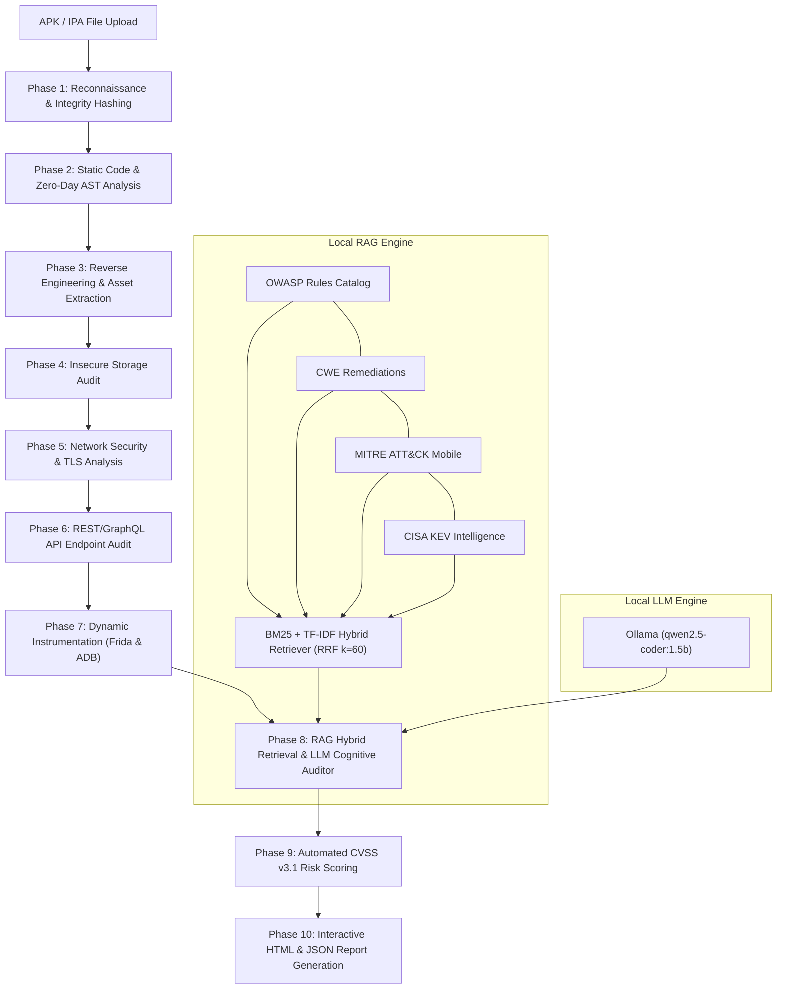

# 🛡️ LLM-Powered Autonomous Mobile Application Security Penetration Testing Platform (MSA v2.0)

[](https://www.gnu.org/licenses/gpl-3.0)
[](https://www.python.org/)
[](https://fastapi.tiangolo.com/)
[](https://ollama.com/)
[](https://owasp.org/www-project-mobile-top-10/)
[](https://owasp.org/www-project-api-security/)
[](#-the-10-phase-security-pipeline)

> **Mobile Security Agent (MSA v2.0)** is an autonomous, privacy-preserving mobile application penetration testing and vulnerability auditing platform. It combines a **10-phase automated security analysis pipeline** with an **in-memory hybrid Retrieval-Augmented Generation (RAG) engine** (BM25 + TF-IDF with Reciprocal Rank Fusion) and **localized LLM cognitive reasoning** to detect, verify, score, and remediate Android and iOS weaknesses with zero cloud dependencies.

---

## 📑 Table of Contents

- [Key Capabilities](#-key-capabilities)
- [System Architecture](#-system-architecture)
- [The 10-Phase Security Pipeline](#-the-10-phase-security-pipeline)
- [Vulnerability Detection & Attack Surface Coverage](#-vulnerability-detection--attack-surface-coverage)
- [RAG Engine & Threat Intelligence](#-rag-engine--threat-intelligence)
- [Dual-Tier Static & Dynamic Verification](#-dual-tier-static--dynamic-verification)
- [Interactive Security Reports & Remediation](#-interactive-security-reports--remediation)
- [Quickstart & Installation](#-quickstart--installation)
  - [Prerequisites](#prerequisites)
  - [1-Click Windows Launchers](#1-click-windows-launchers)
  - [Manual CLI Setup](#manual-cli-setup)
- [Global Access via Cloudflare Tunnel](#-global-access-via-cloudflare-tunnel)
- [REST API Reference](#-rest-api-reference)
- [Project Structure](#-project-structure)
- [License & Disclaimer](#-license--disclaimer)

---

## ✨ Key Capabilities

- **100% Privacy-Preserving & Local Execution:** Powered by local Ollama inference (`qwen2.5-coder:1.5b` or user-defined models). Mobile application source code, decompiled bytecode, and proprietary secrets never leave your local infrastructure.
- **Hybrid Retrieval-Augmented Generation (RAG v3.0):** Employs dual lexical retrieval (**Okapi BM25** and **TF-IDF**) fused via **Reciprocal Rank Fusion ($k=60$)**, grounded on 1,140+ vetted vulnerability reference documents and 1,248 knowledge graph taxonomy edges.
- **Cognitive False-Positive Suppression:** Evaluates raw pattern matches through an LLM Semantic Auditor that examines enclosing source code context, sanitization logic, and framework defenses to suppress noise and false alerts.
- **Full Threat Standard Alignment:** Comprehensive automated mapping against **OWASP Mobile Top 10 (M1–M10)**, **OWASP API Security Top 10**, **CWE Weakness Catalog**, **MITRE ATT&CK for Mobile**, and **CISA Known Exploited Vulnerabilities (KEV)**.
- **Multi-Engine Decompilation & AST Taint Analysis:** Resilient bytecode decompilation (Jadx $\rightarrow$ APKTool $\rightarrow$ pure-Python Androguard fallback), abstract syntax tree traversal, reflection detection, and data-flow taint tracking.
- **Dynamic Runtime Instrumentation:** Integrated **Frida hook engine** supporting automated root detection verification, anti-tampering bypass audits, dynamic SSL pinning inspection, and IPC broadcast validation.
- **Automated CVSS v3.1 Scoring & Code Patches:** Automatically derives vector-based CVSS metrics and generates ready-to-apply remediation code snippets (in Java, Kotlin, or Swift) for discovered security flaws.
- **Real-Time Security Dashboard:** Responsive cybersecurity web interface featuring live log streaming, multi-phase progress visualization, historical scan telemetry, and one-click HTML/JSON report exports.

---

## 🏗️ System Architecture



---

## 🔍 The 10-Phase Security Pipeline

| Phase | Module Name | Primary Functions | Target Standards |
| :---: | :--- | :--- | :--- |
| **01** | **Reconnaissance** | File integrity SHA-256/MD5 hashing, min/target SDK versions, exported component enumeration, dangerous Android permissions. | M1, M9 |
| **02** | **Static & AST Analysis** | Javalang AST traversal, taint tracking, hardcoded credentials, weak cryptography, reflection audit, zero-day heuristic patterns. | M5, M7, CWE-798 |
| **03** | **Reverse Engineering** | DEX decompilation (Jadx/APKTool/Androguard), smali parsing, hidden URL scraping, internal asset extraction, secret pattern matching. | M9, CWE-693 |
| **04** | **Storage Security** | SQLite database audits, Shared Preferences plaintext checking, world-readable file permissions (`MODE_WORLD_READABLE`), Android Keystore validation. | M2, CWE-276, CWE-312 |
| **05** | **Network Security** | Cleartext HTTP traffic configurations, permissive `TrustManager` implementations, disabled hostname verifiers, SSL pinning integrity checks. | M3, CWE-295, CWE-319 |
| **06** | **API Security** | REST/GraphQL endpoint detection, missing authentication schemes, sensitive token exposure, API parameter tampering vectors. | OWASP API Top 10 |
| **07** | **Dynamic Instrumentation** | Automated Frida runtime hook scripts, root detection bypass analysis, anti-tampering verification, IPC broadcast testing via ADB. | M8, M9, MASVS-RESILIENCE |
| **08** | **RAG Vuln Mapping** | Hybrid BM25/TF-IDF retrieval, knowledge graph taxonomy traversal, LLM cognitive false-positive filtering. | CWE, CAPEC, CVE, KEV |
| **09** | **Risk Assessment** | CVSS v3.1 base score computation, exploitability metrics calculation, aggregate application security posture scoring. | FIRST CVSS v3.1 |
| **10** | **Report Generation** | Interactive dark-mode HTML executive reports, raw JSON dumps, developer remediation code patches with before/after comparisons. | DevSecOps & Compliance |

---

## 🎯 Vulnerability Detection & Attack Surface Coverage

The platform provides comprehensive coverage across the entire mobile attack surface:

### 1. Platform & Component Security (OWASP M1)
- **Exported Activities & Receivers:** Identifies components accessible to malicious third-party apps without permission guards.
- **Insecure Content Providers:** Detects SQL injection flaws (`content://` URI vulnerabilities) and path traversal bugs in provider declarations.
- **PendingIntent Hijacking:** Uncovers mutable `PendingIntent` objects vulnerable to privilege escalation.
- **Task Affinity & Tapjacking:** Highlights missing `filterTouchesWhenObscured` flags and permissive task reparenting.

### 2. Insecure Data Storage & Privacy (OWASP M2)
- **Plaintext SharedPreferences:** Scans for sensitive authentication tokens, user credentials, and PII stored without encryption.
- **Unencrypted SQLite & Realm Databases:** Locates cleartext local databases containing cached business logic data.
- **External Storage Leakage:** Detects writes to world-accessible directories (`/sdcard/`, `Environment.getExternalStorageDirectory()`).
- **Sensitive Data in Logcat:** Traverses code for `Log.d`, `Log.v`, and `System.out.println` leaking sensitive parameters.

### 3. Insecure Communication & Cryptography (OWASP M3 & M5)
- **Cleartext Traffic Enabled:** Validates `android:usesCleartextTraffic` and Network Security Config XML files for HTTP fallbacks.
- **Custom Permissive TrustManagers:** Flags empty `checkServerTrusted()` methods that accept self-signed or invalid certificates.
- **Disabled Hostname Verification:** Flags `ALLOW_ALL_HOSTNAME_VERIFIER` or custom verifiers returning `true`.
- **Deprecated Cryptographic Algorithms:** Flags use of MD5, SHA-1, DES, 3DES, RC4, Blowfish, and ECB mode AES.
- **Static IVs & Hardcoded Keys:** Detects constant byte arrays passed into `IvParameterSpec` or `SecretKeySpec`.

### 4. Code Quality, Reverse Engineering & Tampering (OWASP M7, M8, M9)
- **Dynamic Code Loading:** Audits `DexClassLoader` and `PathClassLoader` instances loading remote or unverified DEX payloads.
- **Unsafe Reflection:** Detects reflection calls circumventing API access controls.
- **Hardcoded Cloud & API Secrets:** High-entropy regex checks for AWS Access Keys, Google API Keys, Stripe Keys, Firebase URLs, JWTs, and private RSA keys.
- **Anti-Debugging & Root Detection Evasion:** Identifies client-side security checks that can be easily bypassed via Frida hooking.

---

## 🧠 RAG Engine & Threat Intelligence

The RAG subsystem (`backend/knowledge/rag_engine.py`) operates as a self-contained, database-less retrieval system:

```
[Raw Findings] ──► [Query Expansion] ──► [BM25 Inverted Index] ──┐
                                                                 ├──► [Reciprocal Rank Fusion (k=60)] ──► [LLM Cognitive Auditor]
[Knowledge Base] ─► [TF-IDF Matrix]  ──► [Sparse Vector Search] ──┘
```

1. **Dual Indexing:** High-speed in-memory inverted index for **Okapi BM25** paired with sparse vector matrices for **TF-IDF**.
2. **Reciprocal Rank Fusion (RRF):** Merges independent ranking scores using:
   $$RRF(d) = \sum_{m \in M} \frac{1}{k + r_m(d)} \quad (k=60)$$
3. **Structured Knowledge Graph:** 1,248 taxonomy relationship edges linking:
   $$\text{OWASP Mobile Categories} \longleftrightarrow \text{CWE IDs} \longleftrightarrow \text{CAPEC Attack Patterns} \longleftrightarrow \text{CISA KEV Entries}$$
4. **Cognitive LLM Auditor:** Feeds the enriched context to a local LLM to verify whether the vulnerability is exploitable or mitigated by surrounding code constructs, suppressing false positives.

---

## 🧪 Dual-Tier Static & Dynamic Verification

To overcome decompilation failures on heavily obfuscated or complex APKs, the platform implements a resilient multi-tier pipeline:

```
                  ┌──► Tier 1: Jadx (Full Java Decompilation)
                  │
[APK Ingestion] ──┼──► Tier 2: APKTool (Smali & Manifest Disassembly)
                  │
                  └──► Tier 3: Androguard (Pure-Python DEX Bytecode Fallback)
```

- **Tier 1 (Jadx):** Generates clean, high-level Java source code trees, enabling Abstract Syntax Tree (AST) parsing with `javalang` to track taint flows from source (e.g., `getIntent().getStringExtra()`) to sink (e.g., `db.rawQuery()`).
- **Tier 2 (APKTool):** Disassembles resources and DEX bytecode into readable Smali opcode representations, ensuring analysis continues even if Java decompilation fails.
- **Tier 3 (Pure-Python Androguard):** Operates directly on the raw ZIP container without external Java toolchain dependencies, inspecting DEX header structures and string pools.
- **Dynamic Tier (Frida & ADB):** Injects dynamic JavaScript instrumentation scripts into the target process to test runtime behaviors, SSL certificate pinning enforcement, and IPC entry points.

---

## 📋 Interactive Security Reports & Remediation

Every completed scan generates comprehensive, developer-ready deliverables:

- **Executive & Technical HTML Report:** Standalone, responsive HTML5 document with dark cybersecurity styling, severity badges (Critical, High, Medium, Low, Info), interactive filtering, and CVSS v3.1 score breakdowns.
- **Developer Remediation Code Patches:** Each finding includes side-by-side code blocks showing the vulnerable implementation alongside the secure, patched pattern (e.g., migrating from `Context.MODE_WORLD_READABLE` to `EncryptedFile` and `MasterKey`).
- **Standardized Machine-Readable JSON:** Full JSON export containing normalized vulnerability definitions, CWE identifiers, OWASP tags, file line references, and raw evidence for seamless integration into CI/CD security pipelines.

---

## 🚀 Quickstart & Installation

### Prerequisites

- **OS:** Windows 10/11, Ubuntu 20.04+, or macOS
- **Python:** Version `3.10` or higher
- **Ollama:** [Installed locally](https://ollama.com/) with model loaded:
  ```bash
  ollama pull qwen2.5-coder:1.5b
  ```

---

### 1-Click Windows Launchers

The repository provides pre-configured Windows batch launchers in the root directory:

1. **Start Ollama Engine:** Double-click [`run_ollama.bat`](file:///e:/Final%20Year%20Project%201st%20prototype/LLM-Powered-Autonomous-Mobile-Application-Security-Penetration-Testing-Platform/run_ollama.bat)
2. **Start Backend Server:** Double-click [`run_server.bat`](file:///e:/Final%20Year%20Project%201st%20prototype/LLM-Powered-Autonomous-Mobile-Application-Security-Penetration-Testing-Platform/run_server.bat) (Serves dashboard on `http://127.0.0.1:8000`)
3. **Launch Global Public HTTPS Access:** Double-click [`run_public_tunnel.bat`](file:///e:/Final%20Year%20Project%201st%20prototype/LLM-Powered-Autonomous-Mobile-Application-Security-Penetration-Testing-Platform/run_public_tunnel.bat)

---

### Manual CLI Setup

1. **Clone the Repository:**
   ```bash
   git clone https://github.com/MrWhiiteHat/LLM-Powered-Autonomous-Mobile-Application-Security-Penetration-Testing-Platform.git
   cd LLM-Powered-Autonomous-Mobile-Application-Security-Penetration-Testing-Platform
   ```

2. **Create and Activate Virtual Environment:**
   ```bash
   python -m venv venv
   # On Windows:
   venv\Scripts\activate
   # On Linux/macOS:
   source venv/bin/activate
   ```

3. **Install Dependencies:**
   ```bash
   pip install -r backend/requirements.txt
   ```

4. **Start the ASGI Backend:**
   ```bash
   cd backend
   python -m uvicorn main:app --host 0.0.0.0 --port 8000
   ```
   Open your browser and navigate to **`http://localhost:8000`**.

---

## 🌐 Global Access via Cloudflare Tunnel

To expose the dashboard over the internet for remote testing on mobile devices or external computers without opening router ports or configuring static IPs:

```bash
run_public_tunnel.bat
```

Or manually using the Cloudflare utility:
```bash
cloudflared tunnel --protocol http2 --url http://127.0.0.1:8000
```
This provisions a secure public endpoint (e.g., `https://*.trycloudflare.com`) routing traffic over HTTP/2 directly to your local instance.

---

## 📡 REST API Reference

| Method | Endpoint | Description |
| :---: | :--- | :--- |
| `POST` | `/api/scan` | Upload APK/IPA binary and launch the asynchronous 10-phase pipeline. |
| `GET` | `/api/scans` | List all historical security scan records with summary metrics. |
| `GET` | `/api/scan/{id}/status` | Poll real-time scan progress, active module phase, and live logs. |
| `GET` | `/api/scan/{id}/findings` | Retrieve identified vulnerabilities enriched with CWE/CVSS metadata. |
| `GET` | `/api/scan/{id}/report/html` | Download or view the self-contained interactive HTML audit report. |
| `GET` | `/api/knowledge/{topic}` | Query the local RAG knowledge base for vulnerability details and mitigation. |
| `GET` | `/api/health` | Backend status check, active workers, and local LLM connection state. |

---

## 📁 Project Structure

```
├── backend/
│   ├── main.py                     # FastAPI application & scan orchestrator
│   ├── config.py                   # Configuration and path settings
│   ├── requirements.txt            # Python dependencies
│   ├── knowledge/
│   │   ├── rag_engine.py           # Hybrid BM25/TF-IDF retriever & knowledge graph
│   │   ├── llm_client.py           # Local Ollama client & prompt management
│   │   └── security_data/          # OWASP, CWE, CAPEC, MITRE, CISA datasets
│   ├── modules/
│   │   ├── static_analysis.py      # Manifest & bytecode regex/pattern analyzer
│   │   ├── ast_analyzer.py         # Abstract Syntax Tree taint & reflection analysis
│   │   ├── reverse_engineering.py  # DEX decompilation & asset extraction
│   │   ├── storage_analysis.py     # SQLite, SharedPrefs & file permissions audit
│   │   ├── network_analysis.py     # Cleartext traffic, TLS & certificate checks
│   │   ├── api_testing.py          # REST/GraphQL endpoint security analysis
│   │   ├── zero_day_analyzer.py    # Heuristic and behavioral anomaly detection
│   │   ├── dynamic_analysis.py     # Frida instrumentation orchestration
│   │   ├── vulnerability_mapper.py # RAG enrichment & taxonomy correlation
│   │   ├── risk_assessment.py      # CVSS v3.1 score computation
│   │   └── report_generator.py     # HTML/JSON audit report rendering
│   └── utils/
│       ├── file_handler.py         # APK archive unpacking and validation
│       └── logger.py               # Structured thread-safe logging
├── frontend/
│   ├── index.html                  # Main security analytics dashboard
│   ├── scan.html                   # Dedicated application scanning console
│   ├── docs.html                   # Interactive technical documentation & API spec
│   ├── features.html               # Security capability breakdown
│   ├── how-it-works.html           # 10-phase pipeline explanation
│   ├── about.html                  # Technical overview & platform specifications
│   ├── app.js                      # Frontend application logic & live log streaming
│   └── styles.css                  # Cyberpunk dark security theme
├── docs/                           # 74-section system architecture specifications
├── figures/                        # High-resolution diagrams & workflow charts
├── run_server.bat                  # One-click FastAPI server launcher
├── run_public_tunnel.bat           # One-click Cloudflare HTTPS tunnel launcher
├── run_ollama.bat                  # One-click Ollama service launcher
├── LICENSE                         # GNU General Public License v3.0 (GPL-3.0)
└── README.md                       # Master platform documentation
```

---

## 📜 License & Disclaimer

### License
This project is licensed under the **GNU General Public License v3.0 (GPL-3.0)**. See the [`LICENSE`](LICENSE) file for complete terms. Under this license, you are free to run, inspect, modify, and redistribute this platform, provided that any derivative works are also released under the GNU GPL v3.0.

### Ethical & Legal Disclaimer
> [!IMPORTANT]
> This platform is developed strictly for **authorized security testing, educational research, and defensive hardening**. Scanning mobile applications without prior explicit written permission from the application owner is strictly prohibited and may violate local and international cyber laws. The project developers and maintainers assume no liability for misuse, unauthorized assessments, or damages resulting from the use of this software.
