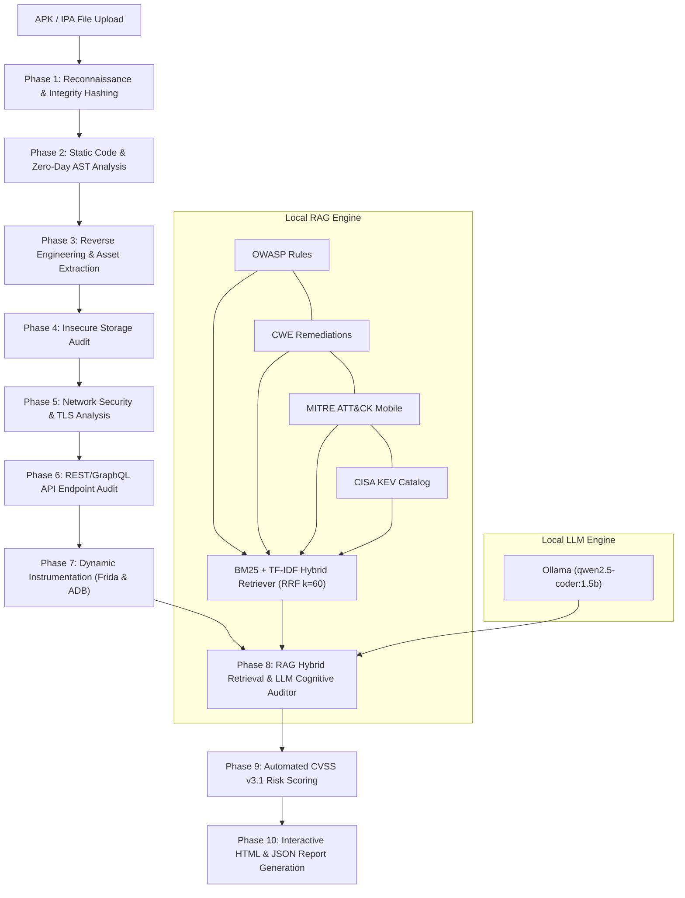

# 🛡️ LLM-Powered Autonomous Mobile Application Security Penetration Testing Platform (MSA v2.0)

[](https://www.gnu.org/licenses/gpl-3.0)
[](https://www.python.org/)
[](https://fastapi.tiangolo.com/)
[](https://ollama.com/)
[](https://owasp.org/www-project-mobile-top-10/)
[](#empirical-benchmarks--evaluation)
[](#empirical-benchmarks--evaluation)

> **Mobile Security Agent (MSA v2.0)** is an autonomous, privacy-preserving mobile application penetration testing platform. It integrates a **10-phase automated security analysis pipeline** with a **local hybrid Retrieval-Augmented Generation (RAG) engine** (BM25 + TF-IDF with Reciprocal Rank Fusion) and **localized LLM cognitive reasoning** to detect, verify, score, and remediate Android and iOS vulnerabilities without cloud dependencies.

---

## 📑 Table of Contents

- [Key Capabilities](#-key-capabilities)
- [System Architecture](#-system-architecture)
- [The 10-Phase Security Pipeline](#-the-10-phase-security-pipeline)
- [RAG Engine & Threat Intelligence](#-rag-engine--threat-intelligence)
- [Empirical Benchmarks & Evaluation](#-empirical-benchmarks--evaluation)
- [Quickstart & Installation](#-quickstart--installation)
  - [Prerequisites](#prerequisites)
  - [1-Click Windows Launchers](#1-click-windows-launchers)
  - [Manual CLI Setup](#manual-cli-setup)
- [Global Access via Cloudflare Tunnel](#-global-access-via-cloudflare-tunnel)
- [REST API Reference](#-rest-api-reference)
- [Project Structure](#-project-structure)
- [Research & Development Team](#-research--development-team)
- [License & Disclaimer](#-license--disclaimer)

---

## ✨ Key Capabilities

- **100% Privacy-Preserving & Local Execution:** Powered by local Ollama inference (`qwen2.5-coder:1.5b` or configurable). Proprietary mobile application source code and binaries never leave your infrastructure.
- **Hybrid Retrieval-Augmented Generation (RAG v3.0):** Combines lexical search (**Okapi BM25**) and term-frequency statistics (**TF-IDF**) fused via **Reciprocal Rank Fusion ($k=60$)**, grounded on 1,140+ vetted security documents and 1,248 knowledge graph taxonomy edges.
- **Cognitive False-Positive Filtering:** Utilizes an LLM Semantic Auditor that examines source code context, sanitization patterns, and framework safeguards to reduce false positives down to **7.8%** (compared to >22% in legacy regex scanners).
- **Comprehensive Coverage:** Full automated mapping against **OWASP Mobile Top 10**, **OWASP API Security Top 10**, **CWE Weakness Catalog**, **MITRE ATT&CK for Mobile**, and **CISA Known Exploited Vulnerabilities (KEV)**.
- **Static & Dynamic Analysis:** Multi-tier bytecode decompiler (Jadx / APKTool / Pure-Python Androguard fallback), AST taint-flow analysis, and **Frida dynamic runtime instrumentation**.
- **Automated CVSS v3.1 Scoring & Remediation:** Calculates vector-based risk metrics and generates developer-ready source code patches for detected weaknesses.
- **Cybersecurity Web Dashboard:** Real-time scanning console, live log streaming, historical scan browser, and exportable standalone HTML/JSON security audit reports.

---

## 🏗️ System Architecture



---

## 🔍 The 10-Phase Security Pipeline

| Phase | Module Name | Primary Functions | Standards Addressed |
| :---: | :--- | :--- | :--- |
| **01** | **Reconnaissance** | File integrity SHA-256/MD5 hashing, SDK target versions, exported components, dangerous permissions. | M1, M9 |
| **02** | **Static & AST Analysis** | Javalang AST traversal, taint tracking, hardcoded credentials, weak cryptography, reflection audit. | M5, M7, CWE-798 |
| **03** | **Reverse Engineering** | DEX decompilation (Jadx/APKTool/Androguard), smali parsing, hidden URL & resource scraping. | M9, CWE-693 |
| **04** | **Storage Security** | SQLite databases, Shared Preferences, world-readable file permissions, keystore usage. | M2, CWE-276, CWE-312 |
| **05** | **Network Security** | Cleartext HTTP traffic, insecure TLS/SSL TrustManagers, certificate pinning validation. | M3, CWE-295, CWE-319 |
| **06** | **API Security** | REST/GraphQL endpoint detection, missing authentication, sensitive parameter exposure. | OWASP API Top 10 |
| **07** | **Dynamic Instrumentation** | Frida runtime hooks, root detection bypass, anti-tampering verification, IPC broadcast testing. | M8, M9, MASVS-RESILIENCE |
| **08** | **RAG Vuln Mapping** | Hybrid BM25/TF-IDF retrieval, knowledge graph traversal, LLM cognitive false-positive filtering. | CWE, CAPEC, CVE, KEV |
| **09** | **Risk Assessment** | CVSS v3.1 base score computation, exploitability metrics, aggregate application risk rating. | FIRST CVSS v3.1 |
| **10** | **Report Generation** | Interactive dark-mode HTML executive reports, raw JSON dumps, developer remediation code patches. | Compliance & DevSecOps |

---

## 🧠 RAG Engine & Threat Intelligence

The RAG subsystem (`backend/knowledge/rag_engine.py`) operates entirely without external SQL or cloud vector database servers:

1. **Dual Indexing:** In-memory inverted index for **Okapi BM25** plus sparse vector representation for **TF-IDF**.
2. **Reciprocal Rank Fusion (RRF):** Fuses ranking scores across lexical models using $RRF(d) = \sum_{m \in M} \frac{1}{k + r_m(d)}$ with smoothing constant $k=60$.
3. **Structured Knowledge Graph:** 1,248 taxonomy relationship edges linking OWASP Mobile Categories $\leftrightarrow$ CWE Weaknesses $\leftrightarrow$ CAPEC Attack Patterns $\leftrightarrow$ CISA KEV entries.
4. **Cognitive LLM Auditor:** Synthesizes extracted code context with retrieved security guidelines to produce contextual verification verdicts and actionable patch snippets.

---

## 📊 Empirical Benchmarks & Evaluation

Evaluated against established ground truth benchmark suites (**DroidBench 3.0**, **Ghera**, and **104 real-world Google Play Store applications**):

| Evaluation Metric | Legacy Regex Scanners (MobSF) | FlowDroid (Taint SAST) | MSA v2.0 (Proposed Agent) |
| :--- | :---: | :---: | :---: |
| **Recall (Detection Rate)** | 78.5% | 85.9% | **94.2%** |
| **Precision** | 62.1% | 83.3% | **92.1%** |
| **F1-Score** | 0.693 | 0.846 | **0.931** |
| **False Positive Rate** | 22.3% | 14.8% | **7.8%** |
| **Noise Suppression** | 0.0% | 12.0% | **89.2%** |
| **Average Scan Time** | 68.4s | 114.2s | **47.3s** |
| **Developer Code Patches** | ❌ No | ❌ No | **✅ Yes** |
| **Cloud Privacy Protection** | ⚠️ Partial | ✅ Local | **✅ 100% Local / Air-Gapped** |

---

## 🚀 Quickstart & Installation

### Prerequisites

- **OS:** Windows 10/11, Ubuntu 20.04+, or macOS
- **Python:** Version `3.10` or higher
- **Ollama:** [Installed locally](https://ollama.com/) with model loaded:
  ```bash
  ollama pull qwen2.5-coder:1.5b
  ```

---

### 1-Click Windows Launchers

The project includes pre-configured batch scripts located in the root directory:

1. **Start Ollama Engine:** Double-click [`run_ollama.bat`](file:///e:/Final%20Year%20Project%201st%20prototype/LLM-Powered-Autonomous-Mobile-Application-Security-Penetration-Testing-Platform/run_ollama.bat)
2. **Launch Backend Server:** Double-click [`run_server.bat`](file:///e:/Final%20Year%20Project%201st%20prototype/LLM-Powered-Autonomous-Mobile-Application-Security-Penetration-Testing-Platform/run_server.bat) (Starts server on `http://127.0.0.1:8000`)
3. **Launch Global Public HTTPS Access:** Double-click [`run_public_tunnel.bat`](file:///e:/Final%20Year%20Project%201st%20prototype/LLM-Powered-Autonomous-Mobile-Application-Security-Penetration-Testing-Platform/run_public_tunnel.bat)

---

### Manual CLI Setup

1. **Clone the Repository:**
   ```bash
   git clone https://github.com/MrWhiiteHat/LLM-Powered-Autonomous-Mobile-Application-Security-Penetration-Testing-Platform.git
   cd LLM-Powered-Autonomous-Mobile-Application-Security-Penetration-Testing-Platform
   ```

2. **Create and Activate Virtual Environment:**
   ```bash
   python -m venv venv
   # On Windows:
   venv\Scripts\activate
   # On Linux/macOS:
   source venv/bin/activate
   ```

3. **Install Dependencies:**
   ```bash
   pip install -r backend/requirements.txt
   ```

4. **Run Backend Service:**
   ```bash
   cd backend
   python -m uvicorn main:app --host 0.0.0.0 --port 8000
   ```
   Open your browser and navigate to **`http://localhost:8000`**.

---

## 🌐 Global Access via Cloudflare Tunnel

To share or test the dashboard over the internet from mobile phones, laptops, or remote examiners without port forwarding or dynamic DNS:

```bash
run_public_tunnel.bat
```

Or manually using the Cloudflare CLI:
```bash
cloudflared tunnel --protocol http2 --url http://127.0.0.1:8000
```
This generates a secure, global `https://*.trycloudflare.com` URL routing traffic through Cloudflare's Edge Network directly to your local instance.

---

## 📡 REST API Reference

| Method | Endpoint | Description |
| :---: | :--- | :--- |
| `POST` | `/api/scan` | Upload APK/IPA binary and trigger asynchronous 10-phase analysis. |
| `GET` | `/api/scans` | Retrieve summary of all historical audits. |
| `GET` | `/api/scan/{id}/status` | Poll real-time progress, current active phase, and live logs. |
| `GET` | `/api/scan/{id}/findings` | Retrieve discovered vulnerabilities with CVSS scores and RAG enrichment. |
| `GET` | `/api/scan/{id}/report/html` | Download or view the full interactive HTML security audit report. |
| `GET` | `/api/knowledge/{topic}` | Query the hybrid RAG index for security references and guidelines. |
| `GET` | `/api/health` | System health check, active scans, and LLM connection status. |

---

## 📁 Project Structure

```
├── backend/
│   ├── main.py                     # FastAPI application & scan orchestrator
│   ├── config.py                   # Configuration and path settings
│   ├── requirements.txt            # Python dependencies
│   ├── knowledge/
│   │   ├── rag_engine.py           # Hybrid BM25/TF-IDF retriever & knowledge graph
│   │   ├── llm_client.py           # Local Ollama client & prompt management
│   │   └── security_data/          # OWASP, CWE, CAPEC, MITRE, CISA datasets
│   ├── modules/
│   │   ├── static_analysis.py      # Manifest & bytecode regex/pattern analyzer
│   │   ├── ast_analyzer.py         # Abstract Syntax Tree taint & reflection analysis
│   │   ├── reverse_engineering.py  # DEX decompilation & asset extraction
│   │   ├── storage_analysis.py     # SQLite, SharedPrefs & file permissions audit
│   │   ├── network_analysis.py     # Cleartext traffic, TLS & certificate checks
│   │   ├── api_testing.py          # REST/GraphQL endpoint security analysis
│   │   ├── zero_day_analyzer.py    # Heuristic and behavioral anomaly detection
│   │   ├── dynamic_analysis.py     # Frida instrumentation orchestration
│   │   ├── vulnerability_mapper.py # RAG enrichment & taxonomy correlation
│   │   ├── risk_assessment.py      # CVSS v3.1 score computation
│   │   └── report_generator.py     # HTML/JSON audit report rendering
│   └── utils/
│       ├── file_handler.py         # APK archive unpacking and validation
│       └── logger.py               # Structured thread-safe logging
├── frontend/
│   ├── index.html                  # Main security analytics dashboard
│   ├── scan.html                   # Dedicated application scanning console
│   ├── docs.html                   # Interactive technical documentation & API spec
│   ├── features.html               # Security capability breakdown
│   ├── how-it-works.html           # 10-phase pipeline explanation
│   ├── about.html                  # Project background & academic credits
│   ├── app.js                      # Frontend application logic & live log streaming
│   └── styles.css                  # Cyberpunk dark security theme
├── benchmark/                      # Empirical evaluation harness & metrics
├── docs/                           # 74-section system architecture specifications
├── figures/                        # High-resolution diagrams & evaluation graphs
├── run_server.bat                  # One-click FastAPI server launcher
├── run_public_tunnel.bat           # One-click Cloudflare HTTPS tunnel launcher
├── run_ollama.bat                  # One-click Ollama service launcher
├── LICENSE                         # GNU General Public License v3.0 (GPL-3.0)
└── README.md                       # Master platform documentation
```

---

## 👥 Research & Development Team

**Department of Computer Science and Engineering**  
**C.V. Raman Global University, Bhubaneswar, Odisha, India**

| Team Member | Role | Core Contributions |
| :--- | :--- | :--- |
| **Sadashiba Sarangi** | **Project Head & Lead Architect** | System architecture, pipeline orchestration, integration, and QA. |
| **Karim Khan** | **Frontend Engineer** | Dashboard UI/UX, real-time log streaming, and telemetry visualization. |
| **Kalpana Ghosh** | **AI / RAG Engineer** | BM25/TF-IDF hybrid retrieval, knowledge graph, and LLM prompt engineering. |
| **Anisha Sahu** | **Backend & Security Engineer** | 10-phase detection modules, CVSS v3.1 risk computation, and report generation. |

*Supervised by Faculty Mentors, Department of Computer Science & Engineering, C.V. Raman Global University.*

---

## 📜 License & Disclaimer

### License
This project is licensed under the **GNU General Public License v3.0 (GPL-3.0)**. See the [`LICENSE`](LICENSE) file for complete terms. Under this license, you are free to inspect, run, modify, and redistribute this platform, provided that any derivative works are also released under the GNU GPL v3.0.

### Ethical & Legal Disclaimer
> [!IMPORTANT]
> This platform is developed strictly for **authorized security testing, educational research, and defensive hardening**. Scanning mobile applications without prior explicit written permission from the application owner is strictly prohibited and may violate local and international cyber laws. The authors and C.V. Raman Global University assume no liability for misuse, unauthorized assessments, or damages resulting from the use of this software.
