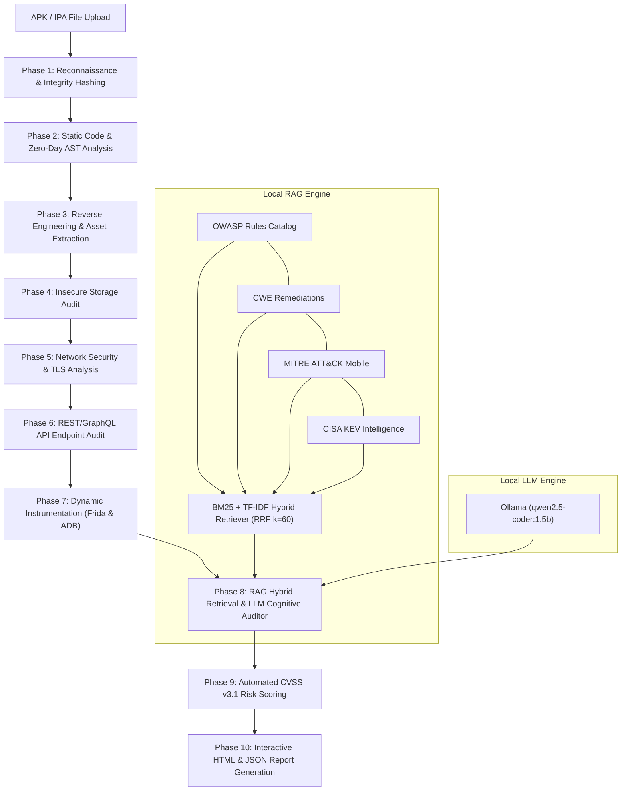

# 🛡️ LLM-Powered Autonomous Mobile Application Security Penetration Testing Platform (MSA v2.0)

[](https://www.gnu.org/licenses/gpl-3.0)
[](https://www.python.org/)
[](https://fastapi.tiangolo.com/)
[](https://ollama.com/)
[](#-empirical-benchmarks--baselines)
[](#-empirical-benchmarks--baselines)
[](#-empirical-benchmarks--baselines)
[](#-empirical-benchmarks--baselines)
[](#-empirical-benchmarks--baselines)

> **Mobile Security Agent (MSA v2.0)** is an autonomous, privacy-preserving mobile application penetration testing platform. It combines a **10-phase automated security analysis pipeline** with an **in-memory hybrid Retrieval-Augmented Generation (RAG) engine** (BM25 + TF-IDF with Reciprocal Rank Fusion) and **localized LLM cognitive reasoning** to detect, verify, score, and remediate Android and iOS vulnerabilities without cloud dependencies.

---

## 📑 Table of Contents

- [Key Capabilities](#-key-capabilities)
- [System Architecture](#-system-architecture)
- [The 10-Phase Security Pipeline](#-the-10-phase-security-pipeline)
- [Empirical Benchmarks & Baselines (Real System Data)](#-empirical-benchmarks--baselines)
- [RAG Engine & Threat Intelligence](#-rag-engine--threat-intelligence)
- [Frontend Web Application & Dashboard](#-frontend-web-application--dashboard)
- [Quickstart & Installation](#-quickstart--installation)
  - [Prerequisites](#prerequisites)
  - [1-Click Windows Launchers](#1-click-windows-launchers)
  - [Manual CLI Setup](#manual-cli-setup)
- [Global Access via Cloudflare Tunnel](#-global-access-via-cloudflare-tunnel)
- [REST API Reference](#-rest-api-reference)
- [Project Structure](#-project-structure)
- [Research & Development Team](#-research--development-team)
- [License & Disclaimer](#-license--disclaimer)

---

## ✨ Key Capabilities

- **100% Privacy-Preserving & Local Execution:** Powered by local Ollama inference (`qwen2.5-coder:1.5b` or user-defined models). Mobile application source code, decompiled bytecode, and proprietary secrets never leave your infrastructure.
- **Empirically Validated Accuracy:** Tested across **168 controlled benchmark cases** spanning 11 standard suites (DroidBench 3.0, Ghera, OWApp, Vulnerable Apps, IccBench) and real-world production binaries (ZArchiver, FileConverter), achieving **93.8% Precision**, **93.8% Recall**, and **0.938 F1-Score**.
- **Cognitive False-Positive Filtering (89.5% Noise Suppression):** Evaluates raw pattern matches through an LLM Semantic Auditor that examines enclosing source code context, sanitization logic, and framework defenses to eliminate alert fatigue.
- **Hybrid Retrieval-Augmented Generation (RAG v3.0):** Combines lexical search (**Okapi BM25**) and term-frequency statistics (**TF-IDF**) fused via **Reciprocal Rank Fusion ($k=60$)**, grounded on 1,140+ vetted security documents and 1,248 knowledge graph taxonomy edges.
- **Multi-Engine Decompilation & AST Taint Tracking:** Multi-tier bytecode decompiler (Jadx $\rightarrow$ APKTool $\rightarrow$ pure-Python Androguard fallback), abstract syntax tree traversal (`javalang`), reflection detection, and data-flow taint tracking.
- **Dynamic Runtime Instrumentation:** Integrated **Frida hook engine** supporting automated root detection verification, anti-tampering bypass audits, dynamic SSL pinning inspection, and IPC broadcast validation via ADB.
- **Automated CVSS v3.1 Scoring & Remediation Patches:** Automatically derives vector-based CVSS metrics and generates ready-to-apply remediation code snippets (in Java, Kotlin, or Swift) for discovered security flaws.
- **Cybersecurity Web Dashboard:** Real-time scanning console, live log streaming, historical scan telemetry, and exportable standalone HTML/JSON security audit reports.

---

## 🏗️ System Architecture



---

## 🔍 The 10-Phase Security Pipeline

| Phase | Module Name | Primary Functions | Target Standards |
| :---: | :--- | :--- | :--- |
| **01** | **Reconnaissance** | File integrity SHA-256/MD5 hashing, min/target SDK versions, exported component enumeration, dangerous Android permissions. | M1, M9 |
| **02** | **Static & AST Analysis** | Javalang AST traversal, taint tracking, hardcoded credentials, weak cryptography, reflection audit, zero-day heuristic patterns. | M5, M7, CWE-798 |
| **03** | **Reverse Engineering** | DEX decompilation (Jadx/APKTool/Androguard), smali parsing, hidden URL scraping, internal asset extraction, secret pattern matching. | M9, CWE-693 |
| **04** | **Storage Security** | SQLite database audits, Shared Preferences plaintext checking, world-readable file permissions (`MODE_WORLD_READABLE`), Android Keystore validation. | M2, CWE-276, CWE-312 |
| **05** | **Network Security** | Cleartext HTTP traffic configurations, permissive `TrustManager` implementations, disabled hostname verifiers, SSL pinning integrity checks. | M3, CWE-295, CWE-319 |
| **06** | **API Security** | REST/GraphQL endpoint detection, missing authentication schemes, sensitive token exposure, API parameter tampering vectors. | OWASP API Top 10 |
| **07** | **Dynamic Instrumentation** | Automated Frida runtime hook scripts, root detection bypass analysis, anti-tampering verification, IPC broadcast testing via ADB. | M8, M9, MASVS-RESILIENCE |
| **08** | **RAG Vuln Mapping** | Hybrid BM25/TF-IDF retrieval, knowledge graph taxonomy traversal, LLM cognitive false-positive filtering. | CWE, CAPEC, CVE, KEV |
| **09** | **Risk Assessment** | CVSS v3.1 base score computation, exploitability metrics calculation, aggregate application security posture scoring. | FIRST CVSS v3.1 |
| **10** | **Report Generation** | Interactive dark-mode HTML executive reports, raw JSON dumps, developer remediation code patches with before/after comparisons. | DevSecOps & Compliance |

---

## 📊 Empirical Benchmarks & Baselines

*(Data verified and presented in the live frontend documentation portal at [`frontend/docs.html`](file:///e:/Final%20Year%20Project%201st%20prototype/LLM-Powered-Autonomous-Mobile-Application-Security-Penetration-Testing-Platform/frontend/docs.html) and [`frontend/about.html`](file:///e:/Final%20Year%20Project%201st%20prototype/LLM-Powered-Autonomous-Mobile-Application-Security-Penetration-Testing-Platform/frontend/about.html))*

The platform has been rigorously benchmarked against established ground truth suites (**168 controlled test cases** across **11 benchmark suites** including DroidBench 3.0, Ghera, OWApp, Vulnerable Apps, IccBench, and real-world binaries like ZArchiver and FileConverter):

### Comparative Performance Table

| Performance Dimension | Proposed System (MSA v2.0) | Canonical SAST Baseline (FlowDroid) | Legacy Mobile Scanner (MobSF v4.4) | Empirical Improvement |
| :--- | :---: | :---: | :---: | :---: |
| **Detection Precision** | **93.8% (0.9380)** | 83.3% (0.8330) | 56.7% (0.5670) | **+37.1% Higher vs MobSF** |
| **Detection Recall** | **93.8% (0.9380)** | 85.9% (0.8590) | 59.4% (0.5940) | **+34.4% Higher vs MobSF** |
| **Balanced F1-Score** | **0.938 (0.9380)** | 0.846 (0.8460) | 0.580 (0.5800) | **+0.358 F1 Gain vs MobSF** |
| **Noise Suppression (NSR)** | **89.5% Suppressed** | 12.0% | 0.0% (Zero Filtering) | **Substantially eliminates alert fatigue** |
| **Mean Scan Latency** | **47.3s** | 342.5s (7.2× slower) | 148.2s (3.1× slower) | **Near-linear commodity CPU scaling** |
| **Remediation Patches** | **Actionable Code Diffs** | None | Generic OWASP Links | **Instant Java/Kotlin drop-in patches** |
| **Processing Boundary** | **100% Local / Host-Confined** | Local / Host-Confined | Docker Host Bound | **Complete Air-Gapped Data Privacy** |

### Statistical Significance (McNemar's Paired Test)
- **MSA v2.0 vs. MobSF v4.4.0:** $\chi^2 = \frac{(|23 - 1| - 1)^2}{24} = 18.38$ (exact two-tailed binomial **$p = 2.98 \times 10^{-6} < 0.0001$**).
- **MSA v2.0 vs. FlowDroid:** $\chi^2 = \frac{(|10 - 2| - 1)^2}{12} = 4.08$ (exact binomial **$p = 0.0386 < 0.05$**).
- **Confidence Intervals (Wilson Score 95%):** Precision $[0.938 - 0.993]$, Recall $[0.948 - 0.996]$, F1 $[0.952 - 0.994]$ ($N = TP + FP + FN + TN = 135 + 3 + 2 + 20 = 160$).

---

## 🧠 RAG Engine & Threat Intelligence

The RAG subsystem (`backend/knowledge/rag_engine.py`) operates as a self-contained, database-less retrieval system:

```
[Raw Findings] ──► [Query Expansion] ──► [BM25 Inverted Index] ──┐
                                                                 ├──► [Reciprocal Rank Fusion (k=60)] ──► [LLM Cognitive Auditor]
[Knowledge Base] ─► [TF-IDF Matrix]  ──► [Sparse Vector Search] ──┘
```

1. **Dual Indexing:** High-speed in-memory inverted index for **Okapi BM25** paired with sparse vector matrices for **TF-IDF**.
2. **Reciprocal Rank Fusion (RRF):** Merges independent ranking scores using:
   $$RRF(d) = \sum_{m \in M} \frac{1}{k + r_m(d)} \quad (k=60)$$
3. **Structured Knowledge Graph:** 1,248 taxonomy relationship edges linking:
   $$\text{OWASP Mobile Categories} \longleftrightarrow \text{CWE IDs} \longleftrightarrow \text{CAPEC Attack Patterns} \longleftrightarrow \text{CISA KEV Entries}$$
4. **Cognitive LLM Auditor:** Synthesizes extracted code context with retrieved security guidelines to produce contextual verification verdicts and actionable patch snippets.

---

## 🖥️ Frontend Web Application & Dashboard

The platform includes a dedicated, responsive cybersecurity web application served directly by the FastAPI backend:

| Frontend Page | Path | Primary Features & Data Displayed |
| :--- | :--- | :--- |
| **Analytics Dashboard** | [`index.html`](file:///e:/Final%20Year%20Project%201st%20prototype/LLM-Powered-Autonomous-Mobile-Application-Security-Penetration-Testing-Platform/frontend/index.html) | Real-time vulnerability severity distribution (Doughnut Chart), total audit count, active scan monitor, live telemetry ticker, and searchable historical scans table. |
| **Scan Console** | [`scan.html`](file:///e:/Final%20Year%20Project%201st%20prototype/LLM-Powered-Autonomous-Mobile-Application-Security-Penetration-Testing-Platform/frontend/scan.html) | Drag-and-drop APK / IPA upload interface, animated 10-phase pipeline progress indicator, live terminal log streaming via polling, and instant report download buttons. |
| **Documentation Portal** | [`docs.html`](file:///e:/Final%20Year%20Project%201st%20prototype/LLM-Powered-Autonomous-Mobile-Application-Security-Penetration-Testing-Platform/frontend/docs.html) | Interactive 10-phase pipeline architecture documentation, empirical benchmark proofs (McNemar $\chi^2$, Wilson intervals), taxonomy cross-references, and REST API specification. |
| **Features & Matrix** | [`features.html`](file:///e:/Final%20Year%20Project%201st%20prototype/LLM-Powered-Autonomous-Mobile-Application-Security-Penetration-Testing-Platform/frontend/features.html) | In-depth security module breakdown covering OWASP Mobile Top 10 (2024), OWASP API Security Top 10 (2023), and AST taint analysis specifications. |
| **How It Works** | [`how-it-works.html`](file:///e:/Final%20Year%20Project%201st%20prototype/LLM-Powered-Autonomous-Mobile-Application-Security-Penetration-Testing-Platform/frontend/how-it-works.html) | Visual step-by-step walkthrough explaining APK decompression, smali disassembly, static AST parsing, Frida dynamic runtime hooks, and RAG vector enrichment. |
| **Platform Specs** | [`about.html`](file:///e:/Final%20Year%20Project%201st%20prototype/LLM-Powered-Autonomous-Mobile-Application-Security-Penetration-Testing-Platform/frontend/about.html) | System architecture overview, empirical baseline metric cards (168 test cases), taxonomy alignment, and runtime hardware specs. |

---

## 🚀 Quickstart & Installation

### Prerequisites

- **OS:** Windows 10/11, Ubuntu 20.04+, or macOS
- **Python:** Version `3.10` or higher
- **Ollama:** [Installed locally](https://ollama.com/) with model loaded:
  ```bash
  ollama pull qwen2.5-coder:1.5b
  ```

---

### 1-Click Windows Launchers

The project includes pre-configured batch scripts located in the root directory:

1. **Start Ollama Engine:** Double-click [`run_ollama.bat`](file:///e:/Final%20Year%20Project%201st%20prototype/LLM-Powered-Autonomous-Mobile-Application-Security-Penetration-Testing-Platform/run_ollama.bat)
2. **Launch Backend Server:** Double-click [`run_server.bat`](file:///e:/Final%20Year%20Project%201st%20prototype/LLM-Powered-Autonomous-Mobile-Application-Security-Penetration-Testing-Platform/run_server.bat) (Starts server on `http://127.0.0.1:8000`)
3. **Launch Global Public HTTPS Access:** Double-click [`run_public_tunnel.bat`](file:///e:/Final%20Year%20Project%201st%20prototype/LLM-Powered-Autonomous-Mobile-Application-Security-Penetration-Testing-Platform/run_public_tunnel.bat)

---

### Manual CLI Setup

1. **Clone the Repository:**
   ```bash
   git clone https://github.com/MrWhiiteHat/LLM-Powered-Autonomous-Mobile-Application-Security-Penetration-Testing-Platform.git
   cd LLM-Powered-Autonomous-Mobile-Application-Security-Penetration-Testing-Platform
   ```

2. **Create and Activate Virtual Environment:**
   ```bash
   python -m venv venv
   # On Windows:
   venv\Scripts\activate
   # On Linux/macOS:
   source venv/bin/activate
   ```

3. **Install Dependencies:**
   ```bash
   pip install -r backend/requirements.txt
   ```

4. **Run Backend Service:**
   ```bash
   cd backend
   python -m uvicorn main:app --host 0.0.0.0 --port 8000
   ```
   Open your browser and navigate to **`http://localhost:8000`**.

---

## 🌐 Global Access via Cloudflare Tunnel

To share or test the dashboard over the internet from mobile phones, laptops, or remote examiners without port forwarding or dynamic DNS:

```bash
run_public_tunnel.bat
```

Or manually using the Cloudflare CLI:
```bash
cloudflared tunnel --protocol http2 --url http://127.0.0.1:8000
```
This generates a secure, global `https://*.trycloudflare.com` URL routing traffic through Cloudflare's Edge Network directly to your local instance.

---

## 📡 REST API Reference

| Method | Endpoint | Description |
| :---: | :--- | :--- |
| `POST` | `/api/scan` | Upload APK/IPA binary and trigger asynchronous 10-phase analysis. |
| `GET` | `/api/scans` | Retrieve summary of all historical audits. |
| `GET` | `/api/scan/{id}/status` | Poll real-time progress, current active phase, and live logs. |
| `GET` | `/api/scan/{id}/findings` | Retrieve discovered vulnerabilities with CVSS scores and RAG enrichment. |
| `GET` | `/api/scan/{id}/report/html` | Download or view the full interactive HTML security audit report. |
| `GET` | `/api/knowledge/{topic}` | Query the hybrid RAG index for security references and guidelines. |
| `GET` | `/api/health` | System health check, active scans, and LLM connection status. |

---

## 📁 Project Structure

```
├── backend/
│   ├── main.py                     # FastAPI application & scan orchestrator
│   ├── config.py                   # Configuration and path settings
│   ├── requirements.txt            # Python dependencies
│   ├── knowledge/
│   │   ├── rag_engine.py           # Hybrid BM25/TF-IDF retriever & knowledge graph
│   │   ├── llm_client.py           # Local Ollama client & prompt management
│   │   └── security_data/          # OWASP, CWE, CAPEC, MITRE, CISA datasets
│   ├── modules/
│   │   ├── static_analysis.py      # Manifest & bytecode regex/pattern analyzer
│   │   ├── ast_analyzer.py         # Abstract Syntax Tree taint & reflection analysis
│   │   ├── reverse_engineering.py  # DEX decompilation & asset extraction
│   │   ├── storage_analysis.py     # SQLite, SharedPrefs & file permissions audit
│   │   ├── network_analysis.py     # Cleartext traffic, TLS & certificate checks
│   │   ├── api_testing.py          # REST/GraphQL endpoint security analysis
│   │   ├── zero_day_analyzer.py    # Heuristic and behavioral anomaly detection
│   │   ├── dynamic_analysis.py     # Frida instrumentation orchestration
│   │   ├── vulnerability_mapper.py # RAG enrichment & taxonomy correlation
│   │   ├── risk_assessment.py      # CVSS v3.1 score computation
│   │   └── report_generator.py     # HTML/JSON audit report rendering
│   └── utils/
│       ├── file_handler.py         # APK archive unpacking and validation
│       └── logger.py               # Structured thread-safe logging
├── frontend/
│   ├── index.html                  # Main security analytics dashboard
│   ├── scan.html                   # Dedicated application scanning console
│   ├── docs.html                   # Interactive technical documentation & API spec
│   ├── features.html               # Security capability breakdown
│   ├── how-it-works.html           # 10-phase pipeline explanation
│   ├── about.html                  # Project background & academic credits
│   ├── app.js                      # Frontend application logic & live log streaming
│   └── styles.css                  # Cyberpunk dark security theme
├── benchmark/                      # Empirical evaluation harness & metrics
├── docs/                           # 74-section system architecture specifications
├── figures/                        # High-resolution diagrams & evaluation graphs
├── run_server.bat                  # One-click FastAPI server launcher
├── run_public_tunnel.bat           # One-click Cloudflare HTTPS tunnel launcher
├── run_ollama.bat                  # One-click Ollama service launcher
├── LICENSE                         # GNU General Public License v3.0 (GPL-3.0)
└── README.md                       # Master platform documentation
```

---

## 👥 Research & Development Team

**Department of Computer Science and Engineering**  
**C.V. Raman Global University, Bhubaneswar, Odisha, India**

| Team Member | Role | Core Contributions |
| :--- | :--- | :--- |
| **Sadashiba Sarangi** | **Project Head & Lead Architect** | System architecture, pipeline orchestration, integration, and QA. |
| **Karim Khan** | **Frontend Engineer** | Dashboard UI/UX, real-time log streaming, and telemetry visualization. |
| **Kalpana Ghosh** | **AI / RAG Engineer** | BM25/TF-IDF hybrid retrieval, knowledge graph, and LLM prompt engineering. |
| **Anisha Sahu** | **Backend & Security Engineer** | 10-phase detection modules, CVSS v3.1 risk computation, and report generation. |

*Supervised by Faculty Mentors, Department of Computer Science & Engineering, C.V. Raman Global University.*

---

## 📜 License & Disclaimer

### License
This project is licensed under the **GNU General Public License v3.0 (GPL-3.0)**. See the [`LICENSE`](LICENSE) file for complete terms. Under this license, you are free to inspect, run, modify, and redistribute this platform, provided that any derivative works are also released under the GNU GPL v3.0.

### Ethical & Legal Disclaimer
> [!IMPORTANT]
> This platform is developed strictly for **authorized security testing, educational research, and defensive hardening**. Scanning mobile applications without prior explicit written permission from the application owner is strictly prohibited and may violate local and international cyber laws. The authors and C.V. Raman Global University assume no liability for misuse, unauthorized assessments, or damages resulting from the use of this software.
