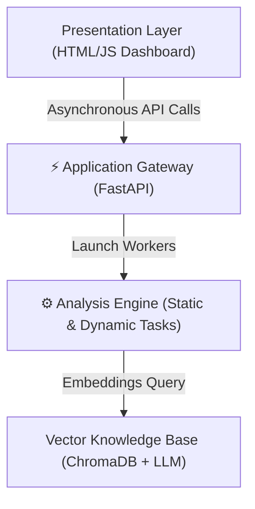

# Chapter 19: System Architecture

The MSA platform relies on a **Decoupled Asynchronous pipeline** structured into a three-layer architecture:

The Application Gateway coordinates incoming requests, stores binaries locally, and spawns concurrent workers for static and dynamic analysis tasks.
