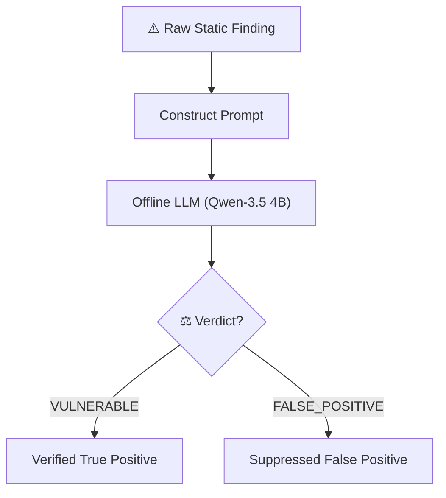

# Chapter 33: AI Verification Pipeline

```mermaid
graph TD
    Finding["⚠️ Raw Static Finding"] --> ContextBuild["Construct Prompt"]
    ContextBuild --> LocalLLM[" Offline LLM (Qwen-3.5 4B)"]
    LocalLLM --> ParseVerdict{"⚖️ Verdict?"}
    ParseVerdict -->|VULNERABLE| TP[" Verified True Positive"]
    ParseVerdict -->|FALSE_POSITIVE| FP[" Suppressed False Positive"]
```
