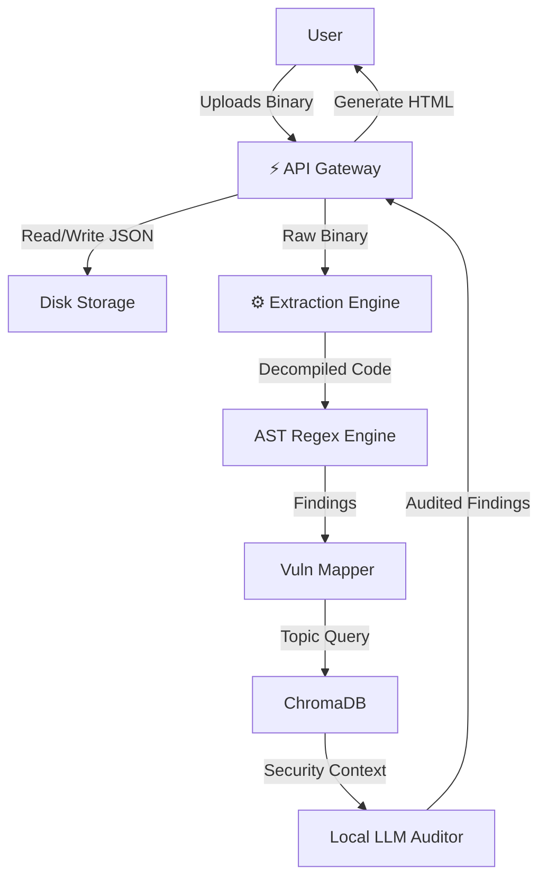

# Chapter 41: Data Flow Diagram (DFD)

```mermaid
graph TD
    User[" User"] -->|Uploads Binary| API["⚡ API Gateway"]
    API -->|Read/Write JSON| Storage[" Disk Storage"]
    API -->|Raw Binary| Extract["⚙️ Extraction Engine"]
    Extract -->|Decompiled Code| AST[" AST Regex Engine"]
    AST -->|Findings| Mapper["️ Vuln Mapper"]
    Mapper -->|Topic Query| Chroma[" ChromaDB"]
    Chroma -->|Security Context| LLM[" Local LLM Auditor"]
    LLM -->|Audited Findings| API
    API -->|Generate HTML| User
```
