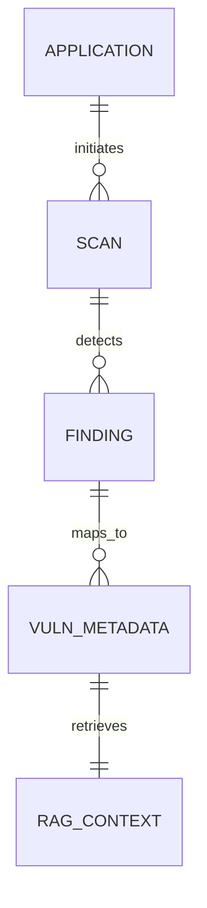

# Chapter 42: Entity Relationship Diagram (ERD)

```mermaid
erDiagram
    APPLICATION ||--o{ SCAN : initiates
    SCAN ||--o{ FINDING : detects
    FINDING ||--o{ VULN_METADATA : maps_to
    VULN_METADATA ||--|| RAG_CONTEXT : retrieves
```
