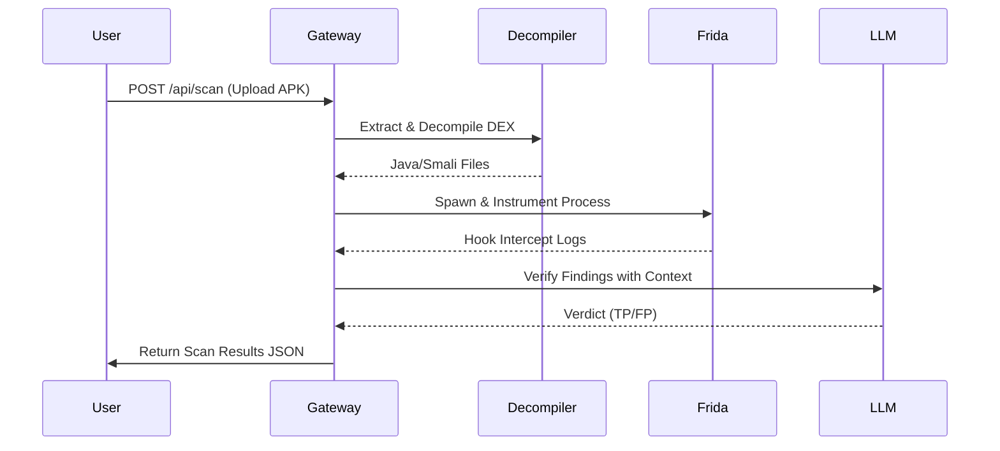

# Chapter 43: Sequence Diagram

```mermaid
sequenceDiagram
    participant User
    participant Gateway
    participant Decompiler
    participant Frida
    participant LLM
    
    User->>Gateway: POST /api/scan (Upload APK)
    Gateway->>Decompiler: Extract & Decompile DEX
    Decompiler-->>Gateway: Java/Smali Files
    Gateway->>Frida: Spawn & Instrument Process
    Frida-->>Gateway: Hook Intercept Logs
    Gateway->>LLM: Verify Findings with Context
    LLM-->>Gateway: Verdict (TP/FP)
    Gateway->>User: Return Scan Results JSON
```
