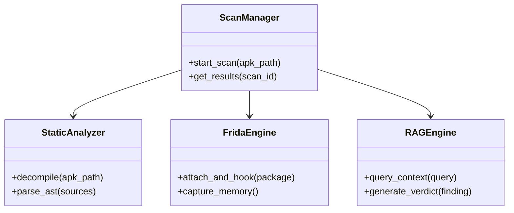

# Chapter 44: Class Diagram

```mermaid
classDiagram
    class ScanManager {
        +start_scan(apk_path)
        +get_results(scan_id)
    }
    class StaticAnalyzer {
        +decompile(apk_path)
        +parse_ast(sources)
    }
    class FridaEngine {
        +attach_and_hook(package)
        +capture_memory()
    }
    class RAGEngine {
        +query_context(query)
        +generate_verdict(finding)
    }
    
    ScanManager --> StaticAnalyzer
    ScanManager --> FridaEngine
    ScanManager --> RAGEngine
```
