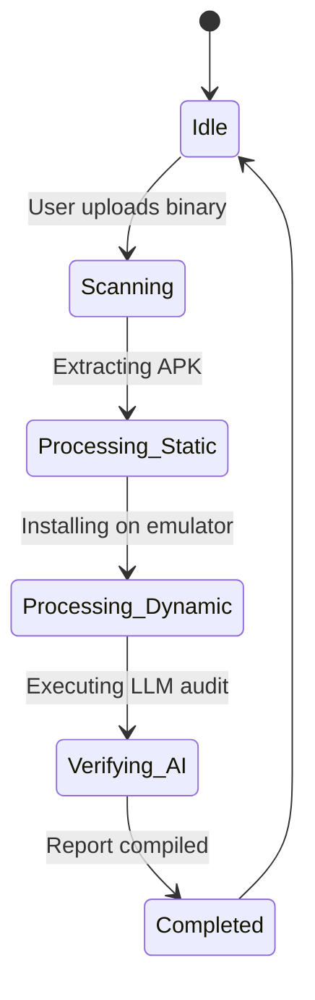

# Chapter 46: State Diagram

```mermaid
stateDiagram-v2
    [*] --> Idle
    Idle --> Scanning : User uploads binary
    Scanning --> Processing_Static : Extracting APK
    Processing_Static --> Processing_Dynamic : Installing on emulator
    Processing_Dynamic --> Verifying_AI : Executing LLM audit
    Verifying_AI --> Completed : Report compiled
    Completed --> Idle
```
