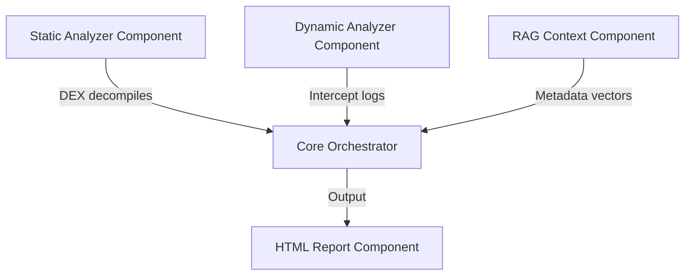

# Chapter 48: Component Diagram

```mermaid
graph TD
    Static["Static Analyzer Component"] -->|DEX decompiles| Core["Core Orchestrator"]
    Dynamic["Dynamic Analyzer Component"] -->|Intercept logs| Core
    RAG["RAG Context Component"] -->|Metadata vectors| Core
    Core -->|Output| HTMLGen["HTML Report Component"]
```
